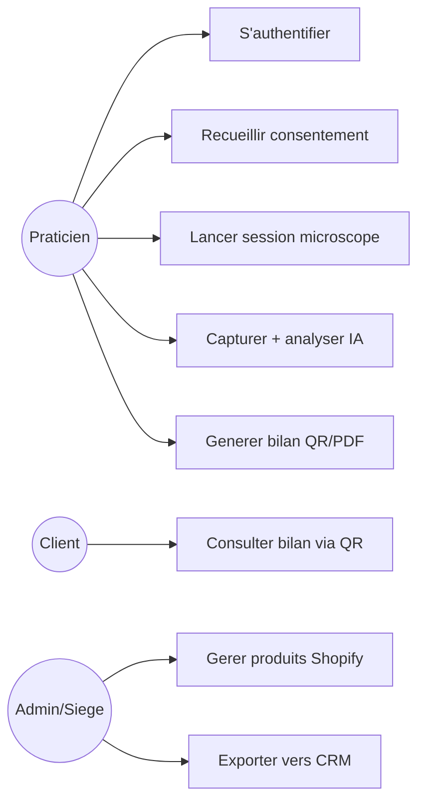
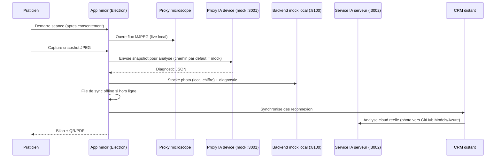
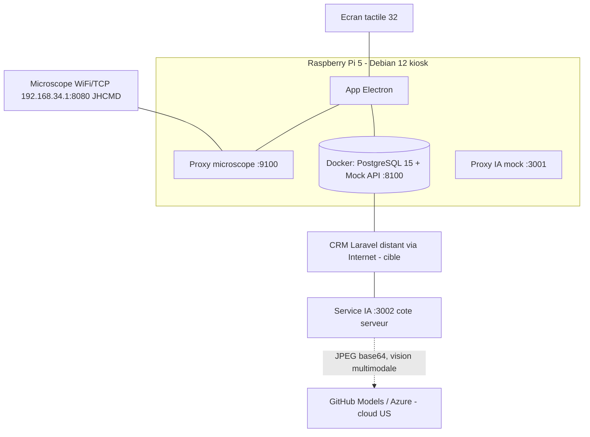

# Miroir connecte d'analyse capillaire - KBEAUTY
## Dossier de soutenance - Titre RNCP 37046 "Chef de projet en solutions logicielles pour l'Internet des Objets"

| | |
|---|---|
| **Candidat** | Adriano Palamara - Developpeur junior full-stack, specialise IoT |
| **Entreprise (alternance)** | OHADJA - SAS, programmation informatique (Paris 8e) |
| **Client** | KBEAUTY-COSMETICS - institut K-beauty (Nice) |
| **Projet** | Miroir connecte de diagnostic capillaire / cuir chevelu (service *Bubble Hair Spa*) |
| **Date de soutenance** | 2026 |
| **Format** | 40 min presentation / 40 min questions / 20 min retour |

> **Note de lecture.** Ce dossier distingue systematiquement ce qui est **realise (MVP)** de ce qui releve de la **cible / roadmap**. Les donnees legales et les faits techniques sont issus de sources officielles ou de la lecture directe du code source. Les analyses (SWOT, PESTEL, prospective) engagent un jugement et sont signalees comme telles. Une cible n'est jamais presentee comme realisee.

---

# SOMMAIRE

1. Presentation personnelle et professionnelle (OHADJA & KBEAUTY) - SWOT KBEAUTY
2. Contexte, PESTEL et veille concurrentielle
3. Cahier des charges fonctionnel (CDCF)
3bis. Devis : estimation temps, budget et J/H en tiroirs
4. Gestion de projet
5. Cahier des charges technique (CDCT) : technologies, souverainete IA, UML, securite, tests, versioning, audit
6. Bilan du projet
- Complements transverses : mapping RNCP, securite, optimisation, preparation a l'oral

---

# PARTIE 1 - Presentation personnelle et professionnelle + SWOT KBEAUTY

## 1.1 Le candidat

Je m'appelle **Adriano Palamara**. Je suis **developpeur junior full-stack oriente IoT**, en **alternance chez OHADJA (SAS)** tout en suivant la formation **Bachelor 3 (niveau 6)** preparant au titre **RNCP 37046 - Chef de projet en solutions logicielles pour l'Internet des Objets** (certificateur FACILITYCERT, ex-ALGOSUP). Ce parcours en alternance me permet d'articuler la theorie de la gestion de projet logiciel avec une mise en pratique continue en entreprise.

Sur ce projet, j'ai porte **seul l'ensemble du cycle** en posture de chef de projet et de realisateur : cadrage du besoin avec le client, conception (modelisation Merise des donnees et des traitements, diagrammes UML), developpement du logiciel embarque et du backend, integration materielle (device kiosk, microscope WiFi), tests, securite et pilotage des arbitrages MVP / cible.

**Technologies mobilisees :** TypeScript, React 19, Electron 33, Zustand, Node.js / Express, PostgreSQL 15, Docker ; chaine qualite Vitest + Playwright et CI GitHub Actions (lint, typecheck, tests, audit de dependances, gitleaks, SBOM, Semgrep) ; securite applicative (chiffrement au repos AES-256-GCM, gestion de secrets). Sur la trajectoire cible figure un CRM Laravel separe (PHP 8.4). Au-dela du code, ce projet m'a surtout fait travailler les competences de **pilotage** : priorisation, gestion du risque, conformite RGPD et communication des arbitrages techniques.

## 1.2 L'entreprise : OHADJA

| Donnee | Valeur (source : annuaire-entreprises.data.gouv.fr) |
|---|---|
| Denomination | OHADJA |
| Forme juridique | SAS (societe par actions simplifiee) |
| SIREN / SIRET siege | 992 146 480 / 992 146 480 00015 |
| Code APE/NAF | **62.01Z - Programmation informatique** |
| Siege | 60 rue Francois Ier, 75008 Paris |
| Creation | 2 octobre 2025 |
| Statut | En activite (unite employeuse) |

OHADJA est un **studio de developpement logiciel** recent, base a Paris. Dans ce projet, OHADJA est le **prestataire technique** : elle concoit et realise la solution pour le compte du client KBEAUTY. J'y interviens comme developpeur en alternance, sous la responsabilite de l'entreprise.

> **Le triangle des acteurs (a poser clairement des la slide 1).** **OHADJA** (prestataire, mon employeur) realise la solution pour **KBEAUTY** (client final, l'institut). "DreamTech" est le nom d'equipe/projet utilise dans le depot technique (`com.dreamtech.smartmirror`), a presenter comme la marque interne du projet, pas comme une societe distincte.

## 1.3 Le client : KBEAUTY-COSMETICS

| Donnee | Valeur (source : annuaire-entreprises.data.gouv.fr + kbeauty-cosmetics.com) |
|---|---|
| Denomination | KBEAUTY-COSMETICS |
| Forme juridique | SAS |
| SIREN / SIRET siege | 912 784 667 / 912 784 667 00061 |
| Code APE/NAF | **47.75Z - Commerce de detail de parfumerie et produits de beaute** |
| Siege | 22 rue de l'Hotel des Postes, 06000 Nice |
| Creation | 1er mai 2022 |
| Effectif | 1 a 2 salaries (TPE) |
| Etablissements actifs | **Nice (siege), Lyon (x2), Cannes** - 4 actifs |

KBEAUTY-COSMETICS est un **distributeur de cosmetiques coreens premium** (environ 50 marques, 400+ references) qui se presente comme **le premier institut de Nice specialise dans les soins coreens**, avec un service signature **Bubble Hair Spa** (soin du cuir chevelu). L'enseigne dispose d'un **e-commerce Shopify** et d'un emailing **Klaviyo**.

> **Mon client principal est la boutique de Nice** (le siege, 22 rue de l'Hotel des Postes). Le projet est concu pour cette boutique en MVP, mais **l'enseigne ayant deja plusieurs villes (Nice, Lyon, Cannes), l'extension du dispositif est un axe naturel**, ce qui fonde le modele economique de duplication.

## 1.4 SWOT de KBEAUTY (l'entreprise cliente)

> Analyse de **l'entreprise KBEAUTY**, pas du produit miroir (qui en est un *levier*). Les forces/faiblesses sont internes ; opportunites/menaces sont externes. Les elements marques *(analyse)* sont des jugements raisonnes a valider, non des donnees constatees.

| **FORCES** (interne +) | **FAIBLESSES** (interne -) |
|---|---|
| Positionnement **premium K-beauty** sur un marche porteur ; "premier institut coreen de Nice" (differenciation forte). | **Tres petite structure** : 1 a 2 salaries (donnee legale). Capacite d'investissement et de R&D limitee. |
| **Maillage physique** : 4 boutiques actives (Nice, 2x Lyon, Cannes), zones a fort pouvoir d'achat. | **Dependance a un prestataire externe** (OHADJA) pour la conception et la maintenance de la solution. |
| **Stack e-commerce mature deja en place** : Shopify + Klaviyo, integrables au dispositif. | **Processus actuel sur tablette**, peu valorisant et sans capture longitudinale structuree. |
| **Base clients existante** et service relationnel premium (*Bubble Hair Spa*). | **Jeune entreprise** (creee 2022) : notoriete et tresorerie encore en construction *(analyse)*. |

| **OPPORTUNITES** (externe +) | **MENACES** (externe -) |
|---|---|
| **Tendance de fond K-beauty** et demande d'experiences personnalisees (58 % des consommateurs en 2026, source marche). | **Concurrents finances** : L'Oreal/Kerastase **K-Scan**, **BECON** (coreen, soutenu par Samsung), FotoFinder, Aram Huvis. |
| **Modele franchise / B2B instituts** : duplication du concept eprouve. | **Risque de requalification reglementaire** (MDR) en cas de glissement vers une allegation therapeutique. |
| **Fidelisation par suivi longitudinal IA** : cree un cout de sortie client et de l'upsell vers Shopify. | **Transfert de donnees hors UE** si l'analyse reste cloud non souverain (risque RGPD, image de marque). |
| Marche francais du **miroir-diagnostic en institut quasi vierge** : fenetre de positionnement. | **Copie du concept** par un acteur mieux dote en marketing/R&D. |

**Exploitation strategique (S-O / W-T).** KBEAUTY peut transformer la conjonction *marque premium + boutiques physiques + e-commerce Shopify* en faisant du diagnostic instrumente le prolongement naturel du *Bubble Hair Spa* : experience premium en boutique, recommandation produit (upsell catalogue Shopify), suivi longitudinal reengage par Klaviyo, puis duplication en franchise. Cote defensif, l'entreprise doit securiser la conformite RGPD, maitriser strictement le **vocabulaire cosmetique** (jamais therapeutique) pour rester hors MDR, et reduire sa dependance technique en exigeant une solution testee et maintenable. Sa petite taille rend ces trois chantiers d'autant plus critiques.

---

# PARTIE 2 - Contexte, PESTEL et veille concurrentielle

## 2.1 Contexte

Aujourd'hui, les praticiens de KBEAUTY realisent leurs diagnostics capillaires **sur tablette**, sans capture structuree ni historique exploitable. Le projet vise un **miroir connecte** qui : capture en direct le cuir chevelu via un **microscope**, propose une **analyse assistee par IA** (orientation, jamais diagnostic medical), genere un **bilan (QR + PDF)**, et **alimente le CRM** pour le suivi et la fidelisation. Le positionnement produit : *"Votre cuir chevelu, analyse par IA. Votre soin, revele par K Beauty Cosmetics."*

## 2.2 PESTEL

| Facteur | Analyse | Implication projet |
|---|---|---|
| **Politique** | Souverainete numerique europeenne, pression sur l'hebergement des donnees en UE. | Plaide pour un hebergement UE et, a terme, une analyse on-device souveraine. |
| **Economique** | Marche smart mirror mondial : **environ 2,5 Md$ (2025) vers 5,3 Md$ (2033), CAGR 7 %** ; miroirs interactifs **CAGR 13,2 %**. Pouvoir d'achat beaute premium resilient. | Marche porteur ; modele duplicable (franchise) economiquement viable. |
| **Social** | **58 %** des consommateurs recherchent des experiences personnalisees (2026) ; engouement K-beauty ; sensibilite accrue a la vie privee. | Le diagnostic personnalise est un argument fort, mais le consentement doit etre irreprochable. |
| **Technologique** | Maturite de l'IA vision ; microscopes WiFi abordables ; Raspberry Pi 5 performant ; dependance aux fournisseurs d'IA cloud. | Faisabilite technique reelle a cout maitrise ; risque de dependance a un fournisseur cloud US (GitHub Models / Azure). |
| **Environnemental** | Consommation maitrisee (Pi 5 : **5,7 a 6,8 W**), microSD vs SSD, parc de 6 miroirs. Kiosk 24/7 = poste backlight ecran dominant. | Faible empreinte unitaire ; argument d'eco-conception (materiel sobre, duree de vie). |
| **Legal** | **RGPD** (consentement, minimisation, retention ; art. 9 "donnees de sante" par precaution ; transfert hors UE art. 44-46, Schrems II) ; **MDR evite** (finalite cosmetique) ; **RED art. 3.3** (cybersecurite radio, depuis 01/08/2025) ; **CRA** (signalement vuln. 11/09/2026, SBOM 11/12/2027). | C'est le facteur structurant : voir Partie 5 / securite et souverainete IA. La conformite est une **barriere a l'entree** si bien tenue. |

## 2.3 Veille concurrentielle

> **A ne jamais dire : "aucun concurrent".** Le creneau precis (miroir + microscope + IA + CRM en institut K-beauty) est peu peuple **en France**, mais des acteurs serieux existent a l'echelle adjacente.

| Acteur | Type | Force | Limite vs notre projet |
|---|---|---|---|
| **L'Oreal / Kerastase K-Scan** | Camera + IA cuir chevelu en salon | Puissance marketing, R&D | Ecosysteme ferme, pas d'integration CRM/boutique independante |
| **BECON** (Coree, soutenu Samsung) | Scanner capillaire IA | Credibilite K-beauty native | Oriente grand public/clinique, peu de presence FR |
| **FotoFinder** | Trichoscopie medicale | Precision clinique | Dispositif medical, cout eleve, hors cosmetique |
| **Aram Huvis (ARAMO)** | Sondes diagnostic peau/cuir chevelu | Materiel professionnel reconnu | Brique materielle seule, sans logiciel/CRM integre |
| **CareOS / HiMirror** | Miroirs beaute connectes | UX aboutie | Visage/maquillage, pas de diagnostic capillaire microscope |

**Differenciation defendable :** **integration verticale** - microscope abordable + IA a faible cout + **CRM connecte a l'e-commerce Shopify existant**, le tout en **institut K-beauty premium**. Ce n'est pas une superiorite technologique pure, c'est un **assemblage de bout en bout** difficile a copier a court terme par un acteur qui ne possede pas deja la boutique et la base clients.

---

# PARTIE 3 - Cahier des charges fonctionnel (CDCF)

## 3.1 Problematique

Comment **professionnaliser et instrumenter le diagnostic capillaire** en institut KBEAUTY, creer un **historique client exploitable**, alimenter le **CRM** pour la fidelisation et l'upsell, tout en restant **strictement dans le cadre cosmetique** (hors dispositif medical) et **conforme au RGPD** ?

## 3.2 Besoins fonctionnels

- **Application miroir** : flux microscope en direct, captures, analyse IA (5 a 15 photos/seance), **consentement RGPD horodate**, deroule de seance, generation **QR + PDF A4** du bilan.
- **Back-office** : fiches clients, controle du miroir, catalogue produits (Shopify), export CRM, multi-boutique.
- **IA** : 1 appel par photo, reponse JSON structuree, 7 categories d'observation (sebum, rougeur, pellicules, densite, hydratation...), seuil "non concluant" si confiance faible.
- **Synchronisation** : architecture **offline-first**, file d'attente, rien n'est perdu hors ligne.

## 3.3 Contraintes

- **Materielles** : Raspberry Pi 5 (Debian 12, ARM64), microscope, ecran tactile vertical, boitier imprime 3D.
- **Reglementaires** : RGPD (consentement, retention 30 j local / 365 j serveur), finalite **cosmetique** stricte, **flux video live local**.
- **Energie / encombrement** : faible consommation, boitier compact (profil SLIM).
- **Perimetre** : MVP = **1 boutique (Nice)** ; cible = extension Lyon/Cannes.

## 3.4 Solution

Deux briques, le **miroir** (Electron en mode kiosque) et le **back-office**, reliees a un **backend** (mock Express/Node.js + PostgreSQL en MVP, **CRM Laravel separe en cible**) et a un **service d'analyse IA**. Design sombre futuriste coherent avec l'identite K-beauty premium. Tracabilite **besoin -> regle de gestion (RG-001 a RG-010) -> test (TC-01 a TC-06)**.

---

# PARTIE 3bis - Devis : temps, budget et J/H en tiroirs

> Estimation ascendante, justifiee par la **volumetrie reelle du code**. Le chiffrage couvre la mise au niveau production du MVP, pas une reecriture. **TJM retenu : 350 EUR/jour** (developpeur full-stack junior facture via OHADJA), a valider avec OHADJA.

## Tiroirs (jours-homme)

| # | Tiroir | J/H | Justification |
|---|---|---|---|
| 1 | Device / Electron (9 ecrans, IPC) | 22 | Coeur applicatif avance ; stabilisation UI tactile, clavier virtuel, durcissement IPC |
| 2 | Backend mock Express + PostgreSQL et bascule CRM Laravel (cible) | 18 | Contrat d'API, mapping clients/seances, idempotence ; branchement du CRM Laravel separe (cible) |
| 3 | Service IA / proxy (mock device + service cloud) | 10 | Gestion cles, file, retry, journalisation conforme |
| 4 | Microscope / proxy video (WiFi/TCP JHCMD) | 12 | Handshake JHCMD, transcodage ffmpeg H.264 vers MJPEG, snapshot JPEG, latence, codec |
| 5 | UX / Figma (design system "verre") | 14 | Maquettes normees, parcours institut, etats vides/erreurs |
| 6 | **Tests / CI / securite** | 26 | Tiroir le plus lourd : etendre la couverture (services non couverts), durcir la chaine CI/lint/coverage |
| 7 | Provisioning / boitier 3D | 9 | Enrolement, QR, impression 3D iteree, montage |
| 8 | Gestion de projet | 14 | Pilotage, Merise Agile, livrables, recette |
| | **TOTAL** | **125 J/H** | |

## Budget de developpement (CapEx logiciel)

| Total J/H | TJM | **Cout dev** |
|---|---|---|
| 125 | 350 EUR/j (retenu) | **43 750 EUR** |
| 125 | 300 EUR/j (bas) | 37 500 EUR |
| 125 | 450 EUR/j (haut) | 56 250 EUR |

## BOM materiel par miroir (prix corriges, contexte crise RAM 2026)

| Composant | Spec. | Bas (EUR) | Haut (EUR) |
|---|---|---|---|
| Carte | Raspberry Pi 5 **4 Go** (cf. decision RAM) | 150 | 200 |
| Alimentation | 27 W officielle | 12 | 12 |
| Refroidissement | Refroidisseur actif | 8 | 8 |
| Stockage | microSD | 15 | 15 |
| Boitier | PETG imprime (profil SLIM) | 5 | 5 |
| Microscope | WiFi (Ninyoon 4K) | 45 | 45 |
| **Ecran** | **32" (incertitude majeure)** | **700** | **900** |
| Connectique | Dongle / cables | 25 | 25 |
| **Sous-total / miroir** | | **960** | **1 210** |

> **Alerte chiffrage :** l'ecran represente environ 73 % du BOM unitaire, c'est la vraie incertitude du TCO, a figer par devis fournisseur ferme. Le reste est stable.

## TCO 3 ans (scenario median : TJM 350 EUR, parc 6 miroirs, OpEx environ 102 EUR/mois)

| Poste | Montant |
|---|---|
| CapEx developpement (125 J/H) | 43 750 EUR |
| CapEx materiel (6 miroirs, median) | 6 510 EUR |
| OpEx x 36 mois (VPS 45-70 EUR + IA + backup + domaine) | environ 3 690 EUR |
| **TCO 3 ans (median)** | **environ 53 950 EUR** |

> Le **developpement pese environ 80 %** du TCO ; le materiel environ 12 %, l'OpEx environ 7 %. Variables a verrouiller : le **TJM** et le **prix ecran**.

---

# PARTIE 4 - Gestion de projet

## 4.1 Methodologie : Merise Agile + TDD

J'ai conduit le projet en **Merise Agile** : la rigueur Merise pour le **modele de donnees (MCD)** et de **traitements (MCT)**, l'iteration agile pour l'enrichir sprint par sprint (Sprint 0 = MCD squelettique, enrichi ensuite). Cette hybridation repond a la question piege *"Merise, n'est-ce pas du cycle en V ?"* : **oui pour la modelisation, non pour le rythme**. La donnee est modelisee tot et solidement, mais le produit se construit de facon incrementale et testee.

> **Posture honnete :** je suis le **chef de projet unique** de ce projet. Les "agents BYAN" presents dans le depot sont un **outillage d'assistance IA** (generation, revue, fact-check), **jamais une equipe humaine**.

## 4.2 Cycle (5 phases)

Document Project -> Analyse (brief vers besoins) -> Planning (architecture vers epics/stories) -> Solutioning (sprint) -> Implementation (dev vers test vers revue).

## 4.3 Backlog reconstitue (extrait)

| Epic | Stories | J/H | Statut |
|---|---|---|---|
| Seance de diagnostic | consentement, capture, analyse IA, bilan QR/PDF | 30 | Fait (MVP) |
| Provisioning miroir | enrolement, config reseau, QR | 9 | Fait |
| Backend & CRM | API (mock Express), clients, seances, sync | 18 | Fait (mock) / CRM Laravel a brancher (cible) |
| Medias & catalogue | playlist promo, produits Shopify | 8 | Partiel |
| Tests / CI / securite | unit, E2E, CI, durcissement | 26 | Fait (MVP), extension continue |

## 4.4 Niveaux de test

Priorite **Unit > Integration > E2E**. Etat reel : **196 cas** = **60 unitaires Vitest** (sur 5 services : api-client 14, config 14, **crm-sync 18**, crypto-vault 7, sync 7) + **136 E2E Playwright** (4 fichiers : 14 + 65 + 42 + 15). **5 services sur 9** sont couverts en unitaire ; restent non couverts media-cache, microscope, updater et wifi (chantier d'extension identifie). La suite `crypto-vault.service.test.ts` (7 tests) verrouille le chiffrement (le JPEG ecrit sur disque ne commence pas par les octets de signature JPEG, le store ne contient pas le token en clair) et `crm-sync.service.test.ts` (18 cas) couvre la synchronisation, le dechiffrement avant upload et la gestion d'erreur reseau.

---

# PARTIE 5 - Cahier des charges technique (CDCT)

## 5.1 Stack reelle (verifiee dans le code)

| Couche | Technologie (version) |
|---|---|
| Device / UI | **Electron 33** + **React 19** + **TypeScript 5.7** + **Zustand 5** (electron-vite, electron-builder arm64 + x64) |
| Backend device (MVP) | **Mock Express / Node.js** (`smart-mirror/mock-api/src/server.js`), deux apps : Mock API "Laravel" (port **8100**) + Mock proxy IA (port **3001**) |
| Base de donnees serveur | **PostgreSQL 15** (`postgres:15-alpine`), SQL brut via le driver `pg` (aucun ORM), schema charge depuis `init.sql` |
| Stockage local device | **electron-store** (config) + **sync-queue.json chiffre** + fichiers photos **.jpg.enc** ; aucun SQLite sur le device |
| CRM distant (cible) | **Laravel 13 / PHP 8.4** (`crm/backend`), service separe, non embarque sur le miroir |
| IA | Proxy **port 3001** sur le device = analyse **mockee** (`server.js`, scores `Math.random`) ; service IA reel **`crm/ia-service` port 3002**, deploye cote **serveur CRM**, qui envoie la photo au cloud (voir 5.6) |
| Microscope | Proxy + flux **MJPEG** (`http://localhost:9100/stream.mjpg`), transcodage ffmpeg |

> **Precision importante.** Le backend embarque sur le miroir est un **mock Express/Node.js**, pas un Laravel. Le vrai Laravel 13 est un **CRM separe** (`crm/backend`) et constitue la cible roadmap pour le backend de production. Le device ne contient **aucun SQLite** : le stockage local repose sur electron-store, une file de synchronisation JSON chiffree et des fichiers photo chiffres. La base relationnelle (PostgreSQL 15) est cote serveur.

## 5.2 Benchmarks technologiques

- **Electron vs Tauri** : Tauri est meilleur en empreinte/RAM, mais Rust + WebKitGTK est plus risque pour l'UI "glassmorphism", donc **Electron retenu**, Tauri documente en migration future.
- **Codec video** : le Raspberry Pi 5 decode HEVC/H.265 4K60 en hardware **uniquement** ; **H.264, VP9 et AV1 sont decodes en logiciel (CPU)** ; **aucun encodeur video hardware**. Le Pi 5 a supprime le decodeur H.264 hardware du Pi 4 (point verifiable en 30 s par un jury). C'est l'une des raisons du transcodage **ffmpeg** cote proxy microscope.
- **PostgreSQL 15** retenu (multi-tenant `boutique_id`, JSONB pour le diagnostic IA, requetes parametrees anti-injection, types UUID et TEXT[]).

### 5.2.1 Benchmarks et justification chiffree des choix

> Cette sous-section resume les verdicts cles issus du fact-check technique. Le detail complet (chiffres sources, niveaux de confiance L1 a L5, marqueurs [PUBLIE] / [A MESURER] et protocoles reproductibles sur le Pi 5) figure dans `docs/BENCHMARKS-TECHNO-IA.md`. Avertissement transversal : aucun benchmark public ne mesure ces technologies directement sur Raspberry Pi 5 ; les chiffres ci-dessous donnent des ordres de grandeur (souvent issus de machines desktop x86) et doivent etre confirmes par mesure sur le Pi 5 cible pour atteindre le niveau de preuve LEVEL-2 attendu.

**Synthese des arbitrages**

| Choix retenu | Alternative ecartee | Justification chiffree |
|---|---|---|
| **Electron 33** | Tauri 2 | Le mythe "Electron = 2x la RAM de Tauri" repose sur du RSS naif qui compte plusieurs fois la memoire partagee de Chromium. Mesure correctement en PSS/USS (source officielle Tauri #5889, Ubuntu), le surcout reel d'Electron est de ~10 a 20 % seulement (207 vs 185 Mo PSS), et Tauri peut meme consommer davantage en USS. Les ~100-150 Mo economises ne paient pas la reecriture en Rust ni le risque WebKitGTK sur Pi (accel GPU/video on-demand fragile), alors que Chromium embarque par Electron est mur pour un produit video-centric. |
| **Video MJPEG** (`` multipart) | MSE/H.264, WebRTC | Fait fondateur (forum officiel RPi, ingenieurs jamesh et 6by9) : le Pi 5 n'a plus de decodage H.264 materiel (supprime vs Pi 4), seul HEVC est materiel. Le microscope emet du H.264 : toutes les options decodent donc en logiciel sur le CPU, l'argument "decode materiel" ne discrimine personne. MJPEG l'emporte par simplicite (Rasoir d'Ockham) : ``, zero player, zero signaling, decode JPEG trivial, isolation du decode lourd dans le process ffmpeg, et la forte bande passante de MJPEG est sans effet en loopback. |
| **PostgreSQL 15** (serveur) | SQLite (serveur) | Doc officielle SQLite : "un seul writer a la fois", recommande elle-meme un SGBD serveur en multi-acces. Le croisement de performance se situe autour de **8 a 16 connexions concurrentes** : en pic d'ecriture a 16 connexions, PostgreSQL (~35 000 ops/s) depasse SQLite (~23 000 ops/s). Le contexte multi-acces (plusieurs miroirs + back-office + IA serveur) impose le MVCC de PostgreSQL. L'absence de SQLite **cote device** est un choix de simplicite et de chiffrement at-rest (JSON chiffre + electron-store), pas de performance : SQLite y aurait ete techniquement valide. |
| **Express / Node.js** (MVP) | Laravel (MVP) | Coherence de stack (meme langage TypeScript que le front), time-to-market. Ordre de grandeur : Express ~6 000-10 000 req/s vs Laravel-FPM non optimise ~35 req/s. La performance n'est pas le critere decisif ici. |
| **Laravel** (backend cible) | Express / Node.js (cible) | Justifie par l'ecosysteme (Eloquent, auth, admin, RGPD outille) et le profil equipe, **pas** par la performance. Le contre-argument perf est neutralise par Laravel Octane : l'ecart de latence tombe a un facteur ~2-3 du Node (vs ~30x en FPM nu). |
| **React 19 + Zustand** | Svelte/Solid + Redux/Context | En Electron sur Pi, l'avantage de rendu de Svelte/Solid (geomean ~1,05 vs React ~1,5) et de bundle (~8 vs 45 Ko gzip) est domine par le cout incompressible de Chromium (~150-300 Mo RAM) ; le goulot reel est le compositing GPU et le flux video, pas le diff DOM. Zustand (0,49 Ko, selecteurs anti-re-render) est plus adapte que Redux (~17 Ko) ou Context seul (re-renders en cascade). |

**Volet IA : modeles vision cloud**

| Critere | Verdict | Justification |
|---|---|---|
| Qualite prouvee (MVP) | **gpt-4o-mini** (GitHub Models) | Seul modele du comparatif avec un score MMMU publie (59,4). Mistral ne publie aucun score MMMU/DocVQA chiffre pour ses modeles vision courants (les seuls chiffres solides concernaient Pixtral Large, deprecie). |
| Souverainete / RGPD (cible) | **Mistral Large 3** | Routage UE par defaut + Zero Data Retention disponible, vision native, GDPR natif. Argument decisif sur des photos de cuir chevelu/visage (donnee sensible) face a GitHub Models (tenant Azure US, Cloud Act applicable). |
| Cout | Ministral 3-3B ou GitHub Models free tier | ~0,17 EUR / 1000 analyses, ou 0 EUR dans le quota gratuit. |

Recommandation consolidee : MVP/demo sur GitHub Models free tier (gpt-4o-mini, deja cable dans `crm/ia-service`) ; cible production sur Mistral Large 3 pour la souverainete UE, sous reserve de validation qualite par un protocole capillaire (accord modele/praticienne via Cohen's kappa). Limite assumee : aucun benchmark public ne mesure l'analyse capillaire, la correlation benchmark generique vers performance capillaire reste une hypothese a tester.

**Volet IA : edge 100 % locale**

| Voie locale | Verdict | Justification chiffree |
|---|---|---|
| **Hailo-8 classification** (CNN) | Recommande pour l'offline temps reel | ResNet-50 a ~1371 FPS en hardware pur, ~40-45 FPS en **pipeline reel** (le seul chiffre qui compte : le Pi 5 limite le PCIe a Gen3 x1), latence < 4 ms, ~4 W, sortie deterministe labels + scores. Largement au-dessus du besoin capillaire. **Ne fait PAS de VLM generatif** (architecture vision, pas de KV-cache transformer). |
| Petits VLM sur CPU Pi 5 | Acceptable MVP seulement | moondream2 / Qwen2.5-VL 3B a ~2-10 tok/s avec un TTFT de plusieurs secondes : pas du temps reel. |
| Hailo-10H | Emergent (janvier 2026) | Le claim "10-25x plus rapide que le CPU" est trompeur : sur le debit de decode, le CPU du Pi 5 est souvent plus rapide. Le Hailo-10H gagne reellement sur le TTFT (320 ms vs 2039 ms) et la conso, pas sur le debit brut. Ecosysteme encore jeune. |

Conclusion edge : pour une analyse capillaire 100 % locale, la voie realiste est la classification CNN sur Hailo-8 (necessite d'entrainer et compiler un modele capillaire custom en HEF) ; le VLM generatif reste pertinent cote serveur, ce qui correspond a l'architecture actuelle (`crm/ia-service` vers GitHub Models).

> Tous les chiffres ci-dessus sont des ordres de grandeur a confirmer sur le Pi 5 reel. Les protocoles de mesure reproductibles (PSS Electron, latence glass-to-glass MJPEG, pgbench et autocannon/wrk, FPS DevTools, latence/cout token des modeles cloud, FPS pipeline Hailo et tok/s VLM) sont detailles dans la section 4 de `docs/BENCHMARKS-TECHNO-IA.md`.

## 5.3 Modelisation UML

> Ces diagrammes **completent** la modelisation Merise. Le MCD compte **8 entites** (BOUTIQUE, CLIENTE, CONSENTEMENT, MIROIR, SEANCE, PHOTO, PRODUIT, MEDIA) tandis que la base `init.sql` compte **9 tables** : l'ecart est la table technique **`config_miroir`** (configuration UI du miroir), presente en base mais absente du MCD. Certains attributs different aussi entre MCD et SQL (MIROIR : `device_token` / `is_online` / `ip_address` en base ; PRODUIT : `affiche_miroir`). Detail complet dans `docs/livrables/05-uml-diagrammes.md`.

**Cas d'usage (synthese)**

**Sequence - workflow seance**

**Deploiement**

## 5.4 Securite

**Fondations realisees (verifiees dans le code) :**

- **Durcissement Electron** : `contextIsolation: true`, `nodeIntegration: false`, `sandbox: true`, preload via `contextBridge`, IPC typee, kiosque durci. **CSP en production** appliquee via `onHeadersReceived` (conditionnee a `!is.dev`).
- **Acces base** : requetes SQL **parametrees** via le driver `pg` (anti-injection).
- **Chiffrement au repos AES-256-GCM** via le service `CryptoVault` (voir 5.4.1).
- **Gestion de secrets** : tokens CRM et secrets de configuration chiffres au repos ; pas de branche plaintext en production.

### 5.4.1 Chiffrement au repos (CryptoVault)

Le chiffrement au repos est assure par un service **`CryptoVault`** en **AES-256-GCM** (chiffrement authentifie avec tag GCM). Le format de payload est `[version 1 octet || IV 12 octets || authTag 16 octets || ciphertext]`. Sont chiffres :

- les **photos de cuir chevelu** (`.jpg.enc`),
- la **file de synchronisation** JSON (`sync-queue.json`),
- les **secrets et tokens** de configuration.

La gestion de la cle maitre suit un ordre de priorite : variable d'environnement `SMART_MIRROR_MASTER_KEY` (base64 32 octets), puis `CREDENTIALS_DIRECTORY` (systemd-creds), puis `MASTER_KEY_FILE`, puis une cle de developpement locale (permissions 0600). **En production sans cle maitre, le service leve une erreur** (pas de degrade silencieux). Le `safeStorage` d'Electron **n'est pas utilise en production** : il est remplace par CryptoVault. Le module crm-sync **dechiffre les `.jpg.enc` avant upload** et retire le suffixe `.enc` du nom distant.

### 5.4.2 CI / CD et garde-fous (etat reel des gates)

| Controle CI | Bloquant | Detail |
|---|---|---|
| `npm audit --omit=dev --audit-level=critical` | **Oui (bloquant)** | Limite aux CVE CRITICAL en dependances de production |
| `npm audit --audit-level=high` | Non (continue-on-error) | Audit large, informatif |
| **gitleaks** (job `secrets-scan`) | **Oui (bloquant)** | Detection de secrets dans le depot |
| **SBOM CycloneDX** | Non (continue-on-error) | Genere et uploade en artefact (exigence CRA) |
| **Semgrep** | Non (continue-on-error) | Analyse statique de securite (informatif) |
| typecheck + lint + tests/coverage + build | Oui | Chaine qualite standard |

> Les gates **reellement bloquants** sont : `npm audit` CRITICAL/prod et **gitleaks**. Le SBOM CycloneDX et Semgrep sont presents mais **non bloquants** (informatifs/artefacts), tout comme l'audit `high`/dev. Cette gradation est assumee : on bloque sur le risque critique avere, on instrumente le reste sans paralyser le pipeline.

### 5.4.3 Audit dependances et chantiers cible

`npm audit` remonte un ensemble de CVE quasi toutes en *devDependencies* (build/test/dev) ; le composant runtime embarque a surveiller en priorite est **Electron**. L'audit est a rejouer la veille de l'oral (les CVE evoluent). Chantiers de securite cote **cible** : durcissement du backend de production (CRM Laravel : protection des PDF de seance, hachage `device_token`, gestion stricte des secrets) et chiffrement colonne (`pgcrypto`) sur les donnees sensibles cote serveur.

## 5.5 Tests, versioning

- **Tests** : 196 cas (60 unitaires Vitest + 136 E2E Playwright), config de **couverture** Vitest, `playwright.config.ts`, **flat config ESLint 9**.
- **CI/CD** : `.github/workflows/ci.yml` : typecheck + lint + tests/coverage + build + npm audit + gitleaks + SBOM + Semgrep (voir 5.4.2).
- **Build / packaging** : electron-builder, cibles **Linux uniquement** = **deb + AppImage**, chacun pour **arm64 ET x64** (bi-architecture). appId `com.dreamtech.smartmirror`, publication `provider: generic` via `UPDATE_SERVER_URL`. Aucune cible Windows ni macOS.
- **Versioning** : Git ; le schema du device est en **SQL brut** (`init.sql`), tandis que les **migrations Laravel versionnees relevent du CRM distant** (Laravel reste la cible roadmap pour le backend de production).

## 5.6 Souverainete de l'IA - trajectoire en 3 versions

> Sujet sensible cote RGPD et jury : **ou part la donnee, quelle dependance internet, quelle maitrise UE**. Le projet assume une trajectoire en trois versions, de l'etat actuel non souverain vers une cible 100 % locale.

### Le constat de depart (honnete)

Dans le **service IA reel** du projet (`crm/ia-service`, port 3002, deploye cote **serveur CRM**, pas sur le device), l'analyse envoie la **photo JPEG complete en base64** a **GitHub Models (models.inference.ai.azure.com, infrastructure Azure US)**, en vision multimodale (`image_url`), avec authentification `GITHUB_TOKEN` et des modeles vision (Llama-3.2-11B-Vision, Phi-3.5-vision, gpt-4o-mini). Sur le device lui-meme, le chemin par defaut de l'application reste un **mock** (`server.js`, scores `Math.random`), sans appel reseau et sans vision CPU (aucun OpenCV).

Consequence a reconnaitre : dans cette configuration cloud, **l'image quitte le device vers un cloud US**, ce qui implique un **transfert hors UE** a encadrer (voir Chapitre V RGPD). Pretendre la souverainete avec cette configuration serait faux, d'ou une strategie en 3 versions.

### Tableau comparatif des 3 versions

| Critere | V1 actuelle (GitHub Models / Azure US) | V2 cible (cloud souverain Mistral EU) | V3 cible (NPU local offline) |
|---|---|---|---|
| Statut | **Realise** (service IA serveur) | **Cible / roadmap** | **Cible / roadmap** |
| Souverainete | Faible (cloud US, routage Azure) | Elevee (editeur + hebergement UE) | Maximale (rien ne sort du miroir) |
| Dependance internet | Oui | Oui | **Non** |
| Type de sortie | Langage naturel (vision multimodale) | Langage naturel | Voie A : labels + scores / Voie B : langage naturel |
| Cout materiel | Pi 5 seul | Pi 5 seul | + HAT NPU Hailo (environ 70 a 130 EUR) |
| Statut RGPD | **Transfert hors UE** (a encadrer SCC/DPA) | Pas de transfert hors UE si endpoint EU + ZDR + DPA | Aucun traitement externe (ideal) |

### V1 - actuelle, non souveraine (GitHub Models / Azure US)

C'est l'etat **realise** du service IA reel : photo envoyee a GitHub Models sur infrastructure Azure (US). Bonne qualite d'analyse, mais **non souverain** et **dependant d'internet**. C'est cette version qui declenche l'enjeu RGPD de transfert hors UE traite au Chapitre V.

### V2 - cible : cloud souverain Mistral AI (UE)

Passer a **Mistral AI** (entreprise francaise, siege Paris, entite UE) rendrait l'analyse substantiellement souveraine. Source `help.mistral.ai` : par defaut les donnees sont **hebergees dans l'Union europeenne**, le routage US etant opt-in explicite ; **Zero Data Retention (ZDR)** disponible sur l'API (a contractualiser via DPA). La gamme vision est Mistral Medium 3.5 / Large 3 / Ministral 3 (Pixtral, plus ancien, etant deprecie debut 2026). Ordre de grandeur de cout pour une analyse capillaire sur un petit modele : de la **fraction de centime a environ 1 centime EUR** (a revalider, tarifs en page JS).

Nuances honnetes a poser au jury :
1. Ce n'est pas "100 % local" : l'image **quitte quand meme** le miroir. Souverainete n'est pas confidentialite totale.
2. La souverainete UE depend de la **configuration** (endpoint EU + ZDR active + DPA signe), pas automatique.
3. Verifier le Trust Center / liste des sous-traitants Mistral (aucun sous-traitant hors UE non encadre par des SCC).

### V3 - cible : 100 % locale sur NPU (Hailo sur Pi 5)

La version premium fait tourner l'IA **sur le miroir, sans internet**, via un accelerateur Hailo en M.2/PCIe sur le Pi 5.

Point critique a connaitre : un **VLM generatif "diagnostic en langage naturel 100 % local" n'est pas realiste sur Hailo-8/8L** (accelerateurs vision classique CNN : classification, detection, segmentation ; les poids doivent tenir en SRAM on-chip, ce qui exclut un VLM de plusieurs milliards de parametres). Deux voies realistes :

- **Voie A (recommandee, defendable aujourd'hui)** : classification CNN dediee sur Hailo-8 (par exemple "cuir chevelu sec / gras / pellicules / normal") compilee via le Hailo Dataflow Compiler. Temps reel, faible conso, 100 % offline, souverain, environ 70 a 110 EUR. Sortie = **labels + scores**, le texte cosmetique etant genere cote app par regles/templates.
- **Voie B (prospective)** : VLM generatif local sur **Hailo-10H** (AI HAT+ 2, 15 jan 2026, 8 Go LPDDR4 dedies, environ 130 EUR) faisant tourner de petits VLM, ou un VLM CPU a latence degradee. Sortie en langage naturel, mais qualite inferieure au cloud et maturite recente.

**Phrase cle jury :** en local sur Pi 5, le realiste et fiable aujourd'hui, c'est de la classification d'images dediee (Hailo-8), pas un VLM generatif ; le diagnostic en langage naturel 100 % local ne devient envisageable qu'avec le tres recent Hailo-10H ou un petit VLM CPU a latence degradee.

---

# CHAPITRE V - Conformite RGPD

## V.1 Qualification de la donnee

Une image de cuir chevelu **a finalite cosmetique** n'est en principe **pas une donnee de sante (art. 9 RGPD)** tant qu'aucune finalite medicale n'est revendiquee (diagnostic de pathologie : alopecie, dermatite). Il faut donc **cadrer strictement "cosmetique, non medical"** dans toute la documentation et l'interface, sous peine de bascule en art. 9. Cette qualification juridique est a faire valider par le DPO. Par precaution, le projet applique deja un niveau de protection eleve (consentement explicite, chiffrement au repos, minimisation).

## V.2 Verrou de consentement (a deux niveaux)

Le consentement RGPD est verrouille a deux niveaux, verifies dans le code :

1. **Base de donnees** : la table `seances` porte une cle etrangere `consentement_id UUID NOT NULL REFERENCES consentements(id)`. Aucune seance ne peut exister sans consentement.
2. **Applicatif** : `POST /api/seances` refuse la creation avec un code **HTTP 422** si `consentement_id` est absent, introuvable, ou si le consentement est **revoque** (verification `date_revocation IS NULL`).

Ce double verrou (contrainte d'integrite + refus serveur explicite) garantit qu'une seance et donc une capture ne peut etre rattachee qu'a un consentement valide et non revoque.

## V.3 Minimisation, retention, chiffrement

- **Retention** : 30 jours en local sur le device (purge automatique des `.jpg.enc` expires, jamais ceux encore en file de synchronisation), 365 jours cote serveur.
- **Chiffrement au repos** : AES-256-GCM (CryptoVault) sur les photos, la file de synchronisation et les secrets (voir 5.4.1).
- **Offline-first** : la photo est ecrite chiffree sur disque puis mise en file avant tout reseau ; la synchronisation ne s'execute que si le device est provisionne et reempile l'element en cas d'erreur reseau.

## V.4 Transfert hors UE (point structurant)

Dans la **version 1 actuelle** du service IA reel, la **photo quitte le device vers un cloud US** (GitHub Models / Azure). Cela constitue un **transfert de donnees personnelles hors UE** au sens des art. 44 a 46 RGPD (jurisprudence Schrems II), a **encadrer** : clauses contractuelles types (SCC), analyse d'impact des transferts, information de la personne concernee, et idealement bascule vers une architecture souveraine.

C'est precisement ce que traite la **trajectoire en 3 versions** (section 5.6) :
- **V2 (Mistral EU)** supprime le transfert hors UE si endpoint EU + ZDR + DPA sont en place.
- **V3 (NPU local)** supprime tout traitement externe : la donnee ne quitte plus le miroir, ce qui est la situation ideale au regard du RGPD.

Le passage de V1 vers V2/V3 est donc autant un choix d'architecture qu'un **levier de conformite** et d'image de marque.

---

# PARTIE 6 - Bilan du projet

## 6.1 Ameliorations (roadmap priorisee)

- **P0 (avant prod)** : finaliser le durcissement sur device (CSP/sandbox testes en conditions reelles), rejouer `npm audit` et traiter les CVE runtime, securiser le backend de production.
- **P1** : bascule vers une IA souveraine (V2 Mistral EU) pour supprimer le transfert hors UE ; etendre la couverture de tests aux services non couverts (media-cache, microscope, updater, wifi) ; brancher le CRM Laravel.
- **P2/P3** : spike Tauri ; accelerateur **Hailo** pour classification CNN dediee (V3 voie A, 100 % locale) ; VLM local souverain (V3 voie B).

## 6.2 Bilan personnel

Ce projet m'a fait porter **seul un cycle IoT complet**, du besoin client jusqu'au materiel, en assumant a la fois la posture de chef de projet et celle de realisateur. Mener un projet en solo m'a oblige a formaliser ce qu'une equipe se partage implicitement : cadrer le besoin, modeliser avant de coder, prioriser le backlog, documenter mes decisions et tenir les delais sans pouvoir deleguer. J'en retire une conviction concrete : sur un projet IoT, **la modelisation Merise (MCD/MCT) et les vues UML ne sont pas un livrable academique mais un socle qui evite de payer plus tard les erreurs de conception** dans le code embarque comme dans le backend.

L'apprentissage qui m'a le plus marque est celui de la **securite by design**. Plutot que de traiter la securite en fin de chaine, je l'ai integree au pipeline : chiffrement au repos AES-256-GCM des photos et des files de synchronisation, gestion des secrets par variables d'environnement, et garde-fous automatises en CI (scan **gitleaks** bloquant, **audit de dependances** bloquant sur le risque critique, SBOM CycloneDX et Semgrep pour l'instrumentation CRA). Ce reflexe transforme la securite d'un controle ponctuel et faillible en une propriete verifiee a chaque integration.

J'ai aussi appris a **arbitrer en ingenieur plutot qu'en collectionneur de technologies**. Le choix d'un MVP realiste (Electron/React, backend mock Express + PostgreSQL 15, IA mockee sur le device) distinct d'une cible plus ambitieuse (CRM Laravel separe, IA souveraine) m'a contraint a justifier chaque decision par le contexte et le budget : dimensionnement RAM conditionne a une mesure, codec video du microscope et transcodage ffmpeg, et surtout la trajectoire de souverainete IA (cloud US actuel, cloud UE Mistral, puis NPU local). Sur le plan methode, la pratique du **TDD** (60 tests unitaires Vitest cote device et 136 tests Playwright en e2e, dont une suite anti-regression sur le chiffrement) a change mon rapport au code : ecrire le test d'abord m'a servi de specification executable et m'a donne la confiance necessaire pour refactorer sans casser l'existant.

Enfin, ce projet m'a confronte a la **conformite RGPD sur une donnee sensible par nature** : une analyse capillaire et du cuir chevelu impose un niveau de precaution superieur a une simple photo cosmetique. J'ai conçu le verrou de consentement a deux niveaux (contrainte d'integrite en base + refus serveur HTTP 422 incluant le consentement revoque), la minimisation et la retention maitrisee, et surtout identifie l'enjeu du **transfert hors UE** lie a l'IA cloud, qui fonde la trajectoire vers une IA souveraine. Ce sont precisement ces reflexes (securite, conformite et arbitrage documente) que je veux consolider dans la suite de mon parcours de chef de projet IoT.

## 6.3 Remerciements

Je remercie l'**equipe d'OHADJA** ainsi que mon **tuteur en entreprise, [nom du tuteur entreprise]**, pour l'encadrement, la confiance et le cadre technique qui m'ont permis de mener ce projet de bout en bout en alternance.

Je remercie le client **KBEAUTY / K Beauty Cosmetics** pour la qualite des echanges lors du cadrage du besoin et pour m'avoir confie un cas d'usage concret autour de son service *Bubble Hair Spa*.

Je remercie l'**equipe pedagogique de la formation (ACADENICE)** et mes **formateurs**, pour leur accompagnement tout au long du Bachelor 3, ainsi que le certificateur **FACILITYCERT** pour le cadre du titre RNCP 37046.

Enfin, je remercie les **membres du jury** pour le temps consacre a l'evaluation de ce dossier et de ma soutenance.

---

# COMPLEMENTS TRANSVERSES

## A. Mapping RNCP 37046 (BC01 vers BC06)

| Bloc | Preuves a mettre en avant |
|---|---|
| **BC01 - Cadrer** | CDCF, finalite cosmetique (hors MDR), RG-001 a 010, cadre RGPD |
| **BC02 - Concevoir** | Architecture (device + backend + CRM cible + IA), MCD 8 entites / 9 tables, benchmarks justifies, offline-first, multi-tenant, 3 diagrammes UML, trajectoire souverainete IA |
| **BC03 - Developper** | Code Electron/Express structure, pipeline microscope (ffmpeg, MJPEG), QR/PDF, boitier 3D, Git |
| **BC04 - Tester / mettre en prod** | 196 cas de test, 6 TC critiques, systemd durci, OTA + rollback, CI + CSP + sandbox, **chiffrement au repos AES-256-GCM (device) + anti-regression dediee** |
| **BC05 - Maintenir / evoluer** | Veille CVE, roadmap P0-P3, OTA, SBOM + Semgrep (CRA), trajectoire IA souveraine (V2/V3) |
| **BC06 - Piloter** | Merise Agile justifiee, backlog, priorisation, arbitrages MVP/cible documentes |

## B. Optimisation (signature du projet)

- **Decision RAM** : footprint reel reconstruit depuis le code, environ **1,3 a 2,2 Go**, donc **4 Go suffisent** pour le MVP, 8 Go serait sur-dimensionne. A presenter comme decision d'ingenierie conditionnee a une mesure 48h (`free -m` + `VmRSS`), pas comme un fait acte. Economie environ 115 EUR/parc, reelle mais marginale ; le vrai levier cout est l'ecran.
- **Place** : boitier profil SLIM, environ -28 % d'epaisseur en supprimant le HAT NVMe.
- **Donnees/energie** : retention minimisee (30 j local / 365 j serveur), sync incrementale par checksum, conso **5,7 a 6,8 W**.
- **Budget IA** : cout cloud par analyse tres faible ; l'option on-device (V3) se justifie par la **souverainete/RGPD**, pas par le prix, arbitrage assume.

## C. Preparation a l'oral

**Minutage des 40 minutes**

| Bloc | Min |
|---|---|
| Intro + presentation (OHADJA/KBEAUTY) + SWOT | 4 |
| Contexte + PESTEL + veille | 4 |
| CDCF | 6 |
| Devis / budget / TCO | 3 |
| Gestion de projet | 4 |
| CDCT (archi, souverainete IA, UML, securite, tests) + demo | 13 |
| Optimisation (3 arbitrages chiffres) | 3 |
| Bilan + remerciements | 3 |

**Questions probables (reponses verrouillees)** : transfert hors UE et IA souveraine (V1 cloud US, V2 Mistral EU, V3 NPU local), chiffrement au repos des photos (AES-256-GCM sur le device), dispositif medical, codec Pi 5 et transcodage ffmpeg, Electron vs Tauri, couverture de tests (196), backend mock vs CRM Laravel cible, "aucun concurrent", panne reseau en seance (offline-first), UML vs Merise, scaling multi-boutique. Detail complet dans `docs/DOSSIER-CONNAISSANCE-RNCP.md`.

---

# ANNEXES - documents de travail

- `docs/GROUND-TRUTH-CODE.md` - source de verite du code (preuves fichier:ligne)
- `docs/SOUVERAINETE-IA-3-VERSIONS.md` - analyse detaillee des 3 versions de souverainete IA
- `docs/DOSSIER-CONNAISSANCE-RNCP.md` - cartographie + Q&A jury detaillees
- `docs/livrables/` - SWOT, PESTEL, veille, devis/TCO, gestion de projet, UML (versions detaillees)
