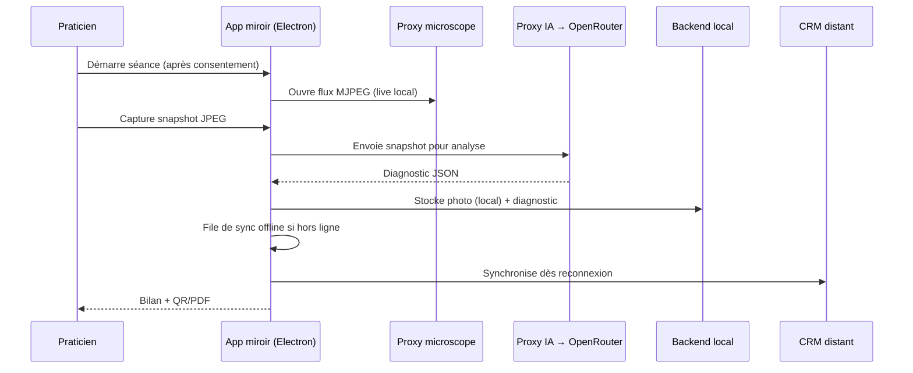
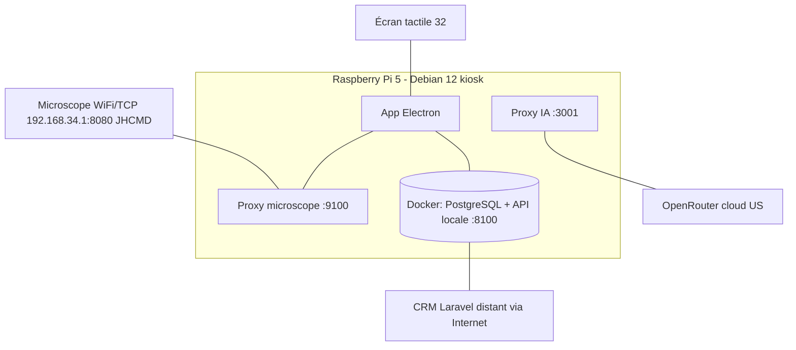

# Miroir connecté d'analyse capillaire — KBEAUTY
## Dossier de soutenance — Titre RNCP 37046 « Chef de projet en solutions logicielles pour l'Internet des Objets »

| | |
|---|---|
| **Candidat** | Adriano — Développeur junior full-stack, spécialisé IoT |
| **Entreprise (alternance)** | OHADJA — SAS, programmation informatique (Paris 8e) |
| **Client** | KBEAUTY-COSMETICS — institut K-beauty (Nice) |
| **Projet** | Miroir connecté de diagnostic capillaire / cuir chevelu (service *Bubble Hair Spa*) |
| **Date de soutenance** | 2026 |
| **Format** | 40 min présentation / 40 min questions / 20 min retour |

> **Note de méthode (transparence épistémique).** Ce document distingue trois statuts d'information : les **faits vérifiés** (données légales officielles, lecture directe du code source — cités comme tels), les **éléments dérivés** du cahier des charges fonctionnel, et les **analyses raisonnées** (SWOT, opportunités/menaces, prospective) qui engagent un jugement et restent à valider. Cette rigueur est volontaire : elle reprend le principe « Zero Trust » du projet (toute affirmation doit être démontrable, quantifiable, reproductible).

---

# SOMMAIRE

1. Présentation personnelle et professionnelle (OHADJA & KBEAUTY) — SWOT KBEAUTY
2. Contexte, PESTEL et veille concurrentielle
3. Cahier des charges fonctionnel (CDCF)
3bis. Devis : estimation temps, budget et J/H en tiroirs
4. Gestion de projet
5. Cahier des charges technique (CDCT) : technologies, UML, sécurité, tests, versioning, audit
6. Bilan du projet
— Compléments transverses : mapping RNCP, sécurité, optimisation, préparation à l'oral

---

# PARTIE 1 — Présentation personnelle et professionnelle + SWOT KBEAUTY

## 1.1 Le candidat

Je m'appelle **Adriano Palamara**. Je suis **développeur junior full-stack orienté IoT**, en **alternance chez OHADJA (SAS)** tout en suivant la formation **Bachelor 3 (niveau 6)** préparant au titre **RNCP 37046 – Chef de projet en solutions logicielles pour l'Internet des Objets** (certificateur FACILITYCERT, ex-ALGOSUP). Ce parcours en alternance me permet d'articuler la théorie de la gestion de projet logiciel avec une mise en pratique continue en entreprise.

Sur ce projet, j'ai porté **seul l'ensemble du cycle** en posture de chef de projet et de réalisateur : cadrage du besoin avec le client, conception (modélisation Merise des données et des traitements, diagrammes UML), développement du logiciel embarqué et du backend, intégration matérielle (device kiosk, microscope WiFi), tests, sécurité et pilotage des arbitrages MVP / cible.

**Technologies mobilisées :** TypeScript, React 19, Electron 33, Zustand, Node.js / Express, PostgreSQL, Docker ; chaîne qualité Vitest + Playwright et CI GitHub Actions (lint, typecheck, tests, audit de dépendances, gitleaks, SBOM) ; sécurité applicative (chiffrement au repos AES-256-GCM, gestion de secrets) ; et, sur la trajectoire cible, l'écosystème Laravel / PHP 8.4 / Redis. Au-delà du code, ce projet m'a surtout fait travailler les compétences de **pilotage** : priorisation, gestion du risque, conformité RGPD et communication des arbitrages techniques.

## 1.2 L'entreprise : OHADJA

| Donnée | Valeur (source : annuaire-entreprises.data.gouv.fr) |
|---|---|
| Dénomination | OHADJA |
| Forme juridique | SAS (société par actions simplifiée) |
| SIREN / SIRET siège | 992 146 480 / 992 146 480 00015 |
| Code APE/NAF | **62.01Z – Programmation informatique** |
| Siège | 60 rue François Ier, 75008 Paris |
| Création | 2 octobre 2025 |
| Statut | En activité (unité employeuse) |

OHADJA est un **studio de développement logiciel** récent, basé à Paris. Dans ce projet, OHADJA est le **prestataire technique** : elle conçoit et réalise la solution pour le compte du client KBEAUTY. J'y interviens comme développeur en alternance, sous la responsabilité de l'entreprise.

> **Le triangle des acteurs (à poser clairement dès la slide 1).** **OHADJA** (prestataire, mon employeur) réalise la solution pour **KBEAUTY** (client final, l'institut). « DreamTech » est le nom d'équipe/projet utilisé dans le dépôt technique — à présenter comme la marque interne du projet, pas comme une société distincte.

## 1.3 Le client : KBEAUTY-COSMETICS

| Donnée | Valeur (source : annuaire-entreprises.data.gouv.fr + kbeauty-cosmetics.com) |
|---|---|
| Dénomination | KBEAUTY-COSMETICS |
| Forme juridique | SAS |
| SIREN / SIRET siège | 912 784 667 / 912 784 667 00061 |
| Code APE/NAF | **47.75Z – Commerce de détail de parfumerie et produits de beauté** |
| Siège | 22 rue de l'Hôtel des Postes, 06000 Nice |
| Création | 1er mai 2022 |
| Effectif | 1 à 2 salariés (TPE) |
| Établissements actifs | **Nice (siège), Lyon (×2), Cannes** — 4 actifs |

KBEAUTY-COSMETICS est un **distributeur de cosmétiques coréens premium** (≈ 50 marques, 400+ références) qui se présente comme **le premier institut de Nice spécialisé dans les soins coréens**, avec un service signature **Bubble Hair Spa** (soin du cuir chevelu). L'enseigne dispose d'un **e-commerce Shopify** et d'un emailing **Klaviyo**.

> **Mon client principal est la boutique de Nice** (le siège, 22 rue de l'Hôtel des Postes). Le projet est conçu pour cette boutique en MVP, mais **l'enseigne ayant déjà 3 villes (Nice, Lyon, Cannes), l'extension du dispositif est un axe naturel** — ce qui fonde le modèle économique de duplication.

## 1.4 SWOT de KBEAUTY (l'entreprise cliente)

> Analyse de **l'entreprise KBEAUTY**, pas du produit miroir (qui en est un *levier*). Les forces/faiblesses sont internes ; opportunités/menaces sont externes. Les éléments marqués *(analyse)* sont des jugements raisonnés à valider, non des données constatées.

| **FORCES** (interne +) | **FAIBLESSES** (interne −) |
|---|---|
| Positionnement **premium K-beauty** sur un marché porteur ; « premier institut coréen de Nice » (différenciation forte). | **Très petite structure** : 1 à 2 salariés (donnée légale). Capacité d'investissement et de R&D limitée. |
| **Maillage physique** : 4 boutiques actives (Nice, 2× Lyon, Cannes), zones à fort pouvoir d'achat. | **Dépendance à un prestataire externe** (OHADJA) pour la conception et la maintenance de la solution. |
| **Stack e-commerce mature déjà en place** : Shopify + Klaviyo, intégrables au dispositif. | **Processus actuel sur tablette**, peu valorisant et sans capture longitudinale structurée. |
| **Base clients existante** et service relationnel premium (*Bubble Hair Spa*). | **Jeune entreprise** (créée 2022) : notoriété et trésorerie encore en construction *(analyse)*. |

| **OPPORTUNITÉS** (externe +) | **MENACES** (externe −) |
|---|---|
| **Tendance de fond K-beauty** et demande d'expériences personnalisées (58 % des consommateurs en 2026, source marché). | **Concurrents financés** : L'Oréal/Kérastase **K-Scan**, **BECON** (coréen, soutenu par Samsung), FotoFinder, Aram Huvis. |
| **Modèle franchise / B2B instituts** : duplication du concept éprouvé. | **Risque de requalification réglementaire** (MDR) en cas de glissement vers une allégation thérapeutique. |
| **Fidélisation par suivi longitudinal IA** : crée un coût de sortie client et de l'upsell vers Shopify. | **Transfert de données hors UE** si l'analyse reste cloud (risque RGPD, image de marque). |
| Marché français du **miroir-diagnostic en institut quasi vierge** : fenêtre de positionnement. | **Copie du concept** par un acteur mieux doté en marketing/R&D. |

**Exploitation stratégique (S-O / W-T).** KBEAUTY peut transformer la conjonction *marque premium + boutiques physiques + e-commerce Shopify* en faisant du diagnostic instrumenté le prolongement naturel du *Bubble Hair Spa* : expérience premium en boutique, recommandation produit (upsell catalogue Shopify), suivi longitudinal réengagé par Klaviyo, puis duplication en franchise. Côté défensif, l'entreprise doit sécuriser la conformité RGPD, maîtriser strictement le **vocabulaire cosmétique** (jamais thérapeutique) pour rester hors MDR, et réduire sa dépendance technique en exigeant une solution testée et maintenable. Sa petite taille rend ces trois chantiers d'autant plus critiques.

---

# PARTIE 2 — Contexte, PESTEL et veille concurrentielle

## 2.1 Contexte

Aujourd'hui, les praticiens de KBEAUTY réalisent leurs diagnostics capillaires **sur tablette**, sans capture structurée ni historique exploitable. Le projet vise un **miroir connecté** qui : capture en direct le cuir chevelu via un **microscope**, propose une **analyse assistée par IA** (orientation, jamais diagnostic médical), génère un **bilan (QR + PDF)**, et **alimente le CRM** pour le suivi et la fidélisation. Le positionnement produit : *« Votre cuir chevelu, analysé par IA. Votre soin, révélé par K Beauty Cosmetics. »*

## 2.2 PESTEL

| Facteur | Analyse | Implication projet |
|---|---|---|
| **Politique** | Souveraineté numérique européenne, pression sur l'hébergement des données en UE. | Plaide pour un hébergement UE (Scaleway) et, à terme, une analyse on-device. |
| **Économique** | Marché smart mirror mondial : **~2,5 Md$ (2025) → 5,3 Md$ (2033), CAGR 7 %** ; miroirs interactifs **CAGR 13,2 %**. Pouvoir d'achat beauté premium résilient. | Marché porteur ; modèle duplicable (franchise) économiquement viable. |
| **Social** | **58 %** des consommateurs recherchent des expériences personnalisées (2026) ; engouement K-beauty ; sensibilité accrue à la vie privée. | Le diagnostic personnalisé est un argument fort, mais le consentement doit être irréprochable. |
| **Technologique** | Maturité de l'IA vision ; microscopes USB/WiFi abordables ; Raspberry Pi 5 performant ; dépendance aux fournisseurs d'IA cloud. | Faisabilité technique réelle à coût maîtrisé ; risque de dépendance fournisseur (OpenRouter). |
| **Environnemental** | Consommation maîtrisée (Pi 5 : **5,7–6,8 W**), microSD vs SSD, parc de 6 miroirs. Kiosk 24/7 = poste backlight écran dominant. | Faible empreinte unitaire ; argument d'éco-conception (matériel sobre, durée de vie). |
| **Légal** | **RGPD** (consentement, minimisation, rétention ; art. 9 « données de santé » par précaution ; transfert hors UE art. 44-46, Schrems II) ; **MDR évité** (finalité cosmétique) ; **RED art. 3.3** (cybersécurité radio, depuis 01/08/2025) ; **CRA** (signalement vuln. 11/09/2026, SBOM 11/12/2027). | C'est le facteur structurant : voir Partie 6 / sécurité. La conformité est une **barrière à l'entrée** si bien tenue. |

## 2.3 Veille concurrentielle

> **À ne jamais dire : « aucun concurrent ».** Le créneau précis (miroir + microscope + IA + CRM en institut K-beauty) est peu peuplé **en France**, mais des acteurs sérieux existent à l'échelle adjacente.

| Acteur | Type | Force | Limite vs notre projet |
|---|---|---|---|
| **L'Oréal / Kérastase K-Scan** | Caméra + IA cuir chevelu en salon | Puissance marketing, R&D | Écosystème fermé, pas d'intégration CRM/boutique indépendante |
| **BECON** (Corée, soutenu Samsung) | Scanner capillaire IA | Crédibilité K-beauty native | Orienté grand public/clinique, peu de présence FR |
| **FotoFinder** | Trichoscopie médicale | Précision clinique | Dispositif médical, coût élevé, hors cosmétique |
| **Aram Huvis (ARAMO)** | Sondes diagnostic peau/cuir chevelu | Matériel professionnel reconnu | Brique matérielle seule, sans logiciel/CRM intégré |
| **CareOS / HiMirror** | Miroirs beauté connectés | UX aboutie | Visage/maquillage, pas de diagnostic capillaire microscope |

**Différenciation défendable :** **intégration verticale** — microscope abordable + IA cloud à très faible coût (~0,002 €/analyse) + **CRM connecté à l'e-commerce Shopify existant**, le tout en **institut K-beauty premium**. Ce n'est pas une supériorité technologique pure, c'est un **assemblage de bout en bout** difficile à copier à court terme par un acteur qui ne possède pas déjà la boutique et la base clients.

---

# PARTIE 3 — Cahier des charges fonctionnel (CDCF)

## 3.1 Problématique

Comment **professionnaliser et instrumenter le diagnostic capillaire** en institut KBEAUTY, créer un **historique client exploitable**, alimenter le **CRM** pour la fidélisation et l'upsell, tout en restant **strictement dans le cadre cosmétique** (hors dispositif médical) et **conforme au RGPD** ?

## 3.2 Besoins fonctionnels

- **Application miroir** : flux microscope en direct, captures, analyse IA (5 à 15 photos/séance), **consentement RGPD horodaté**, déroulé de séance, génération **QR + PDF A4** du bilan.
- **Back-office** : fiches clients, contrôle du miroir, catalogue produits (Shopify), export CRM, multi-boutique.
- **IA** : 1 appel par photo, réponse JSON structurée, 7 catégories d'observation (sébum, rougeur, pellicules, densité, hydratation…), seuil « non concluant » si confiance faible.
- **Synchronisation** : architecture **offline-first**, file d'attente, rien n'est perdu hors ligne.

## 3.3 Contraintes

- **Matérielles** : Raspberry Pi 5 (Debian 12, ARM64), microscope, écran tactile vertical, boîtier imprimé 3D.
- **Réglementaires** : RGPD (consentement, rétention 30 j local / 365 j serveur), finalité **cosmétique** stricte, **flux vidéo live local**.
- **Énergie / encombrement** : faible consommation, boîtier compact (profil SLIM).
- **Périmètre** : MVP = **1 boutique (Nice)** ; cible = extension Lyon/Cannes.

## 3.4 Solution

Deux briques — le **miroir** (Electron en mode kiosque) et le **back-office** — reliées à un **CRM** (Laravel) et à un **service d'analyse IA**. Design sombre futuriste cohérent avec l'identité K-beauty premium. Traçabilité **besoin → règle de gestion (RG-001 à RG-010) → test (TC-01 à TC-06)**.

---

# PARTIE 3bis — Devis : temps, budget et J/H en tiroirs

> Estimation ascendante, justifiée par la **volumétrie réelle du code**. Le chiffrage couvre la mise au niveau production du MVP, pas une réécriture. **TJM retenu : 350 €/jour** (développeur full-stack junior facturé via OHADJA) — *à valider avec OHADJA*.

## Tiroirs (jours-homme)

| # | Tiroir | J/H | Justification |
|---|---|---|---|
| 1 | Device / Electron (9 écrans, IPC) | 22 | Cœur applicatif avancé ; stabilisation UI tactile, clavier virtuel, durcissement IPC |
| 2 | Backend Laravel + base de données | 18 | Contrat d'API, auth Sanctum, mapping clients/séances, idempotence |
| 3 | Service IA / proxy (cloud OpenRouter) | 10 | Gestion clés, file, retry, journalisation conforme |
| 4 | Microscope / proxy vidéo (WiFi/TCP JHCMD) | 12 | Handshake JHCMD, transcodage ffmpeg H.264->MJPEG, snapshot JPEG, latence, codec |
| 5 | UX / Figma (design system « verre ») | 14 | Maquettes normées, parcours institut, états vides/erreurs |
| 6 | **Tests / CI / sécurité** | 26 | Tiroir le plus lourd : combler gaps sécurité, couvrir `crm-sync`, chaîne CI/lint/coverage |
| 7 | Provisioning / boîtier 3D | 9 | Enrôlement, QR, impression 3D itérée, montage |
| 8 | Gestion de projet | 14 | Pilotage, Merise Agile, livrables, recette |
| | **TOTAL** | **125 J/H** | |

## Budget de développement (CapEx logiciel)

| Total J/H | TJM | **Coût dev** |
|---|---|---|
| 125 | 350 €/j (retenu) | **43 750 €** |
| 125 | 300 €/j (bas) | 37 500 € |
| 125 | 450 €/j (haut) | 56 250 € |

## BOM matériel par miroir (prix corrigés, contexte crise RAM 2026)

| Composant | Spéc. | Bas (€) | Haut (€) |
|---|---|---|---|
| Carte | Raspberry Pi 5 **4 Go** (cf. décision RAM) | 150 | 200 |
| Alimentation | 27 W officielle | 12 | 12 |
| Refroidissement | Refroidisseur actif | 8 | 8 |
| Stockage | microSD | 15 | 15 |
| Boîtier | PETG imprimé (profil SLIM) | 5 | 5 |
| Microscope | WiFi (Ninyoon 4K) | 45 | 45 |
| **Écran** | **32" (incertitude majeure)** | **700** | **900** |
| Connectique | Dongle / câbles | 25 | 25 |
| **Sous-total / miroir** | | **960** | **1 210** |

> **Alerte chiffrage :** l'écran représente ~73 % du BOM unitaire — **c'est la vraie incertitude du TCO**, à figer par devis fournisseur ferme. Le reste est stable.

## TCO 3 ans (scénario médian : TJM 350 €, parc 6 miroirs, OpEx ~102 €/mois)

| Poste | Montant |
|---|---|
| CapEx développement (125 J/H) | 43 750 € |
| CapEx matériel (6 miroirs, médian) | 6 510 € |
| OpEx × 36 mois (VPS 45-70 € + IA + backup + domaine) | ~3 690 € |
| **TCO 3 ans (médian)** | **≈ 53 950 €** |

> Le **développement pèse ~80 %** du TCO ; le matériel ~12 %, l'OpEx ~7 %. Variables à verrouiller : le **TJM** et le **prix écran**.

---

# PARTIE 4 — Gestion de projet

## 4.1 Méthodologie : Merise Agile + TDD

J'ai conduit le projet en **Merise Agile** : la rigueur Merise pour le **modèle de données (MCD)** et de **traitements (MCT)**, l'itération agile pour l'enrichir sprint par sprint (Sprint 0 = MCD squelettique, enrichi ensuite). Cette hybridation répond à la question piège *« Merise, n'est-ce pas du cycle en V ? »* : **oui pour la modélisation, non pour le rythme** — la donnée est modélisée tôt et solidement, mais le produit se construit de façon incrémentale et testée.

> **Posture honnête :** je suis le **chef de projet unique** de ce projet. Les « agents BYAN » présents dans le dépôt sont un **outillage d'assistance IA** (génération, revue, fact-check), **jamais une équipe humaine**.

## 4.2 Cycle (5 phases)

Document Project → Analyse (brief → besoins) → Planning (architecture → epics/stories) → Solutioning (sprint) → Implementation (dev → test → revue).

## 4.3 Backlog reconstitué (extrait)

| Epic | Stories | J/H | Statut |
|---|---|---|---|
| Séance de diagnostic | consentement, capture, analyse IA, bilan QR/PDF | 30 | Fait (MVP) |
| Provisioning miroir | enrôlement, config réseau, QR | 9 | Fait |
| Backend & CRM | API, clients, séances, sync | 18 | Fait (mock) / à brancher CRM |
| Médias & catalogue | playlist promo, produits Shopify | 8 | Partiel |
| Tests / CI / sécurité | unit, E2E, CI, durcissement | 26 | **En cours (priorité)** |

## 4.4 Niveaux de test

Priorité **Unit > Intégration > E2E**. État réel : **178 cas** (42 unitaires Vitest + 136 E2E Playwright), **4 services sur 9** couverts en unitaire — le nouveau `crypto-vault.service.test.ts` (7 tests) verrouille le chiffrement (le JPEG écrit sur disque ne commence pas par FF D8, le store ne contient pas le token en clair) ; `crm-sync.service.ts` (372 lignes) reste à couvrir (chantier identifié).

---

# PARTIE 5 — Cahier des charges technique (CDCT)

## 5.1 Stack réelle (vérifiée dans le code)

| Couche | Technologie (version) |
|---|---|
| Device / UI | **Electron 33** + **React 19** + **TypeScript 5.7** + **Zustand 5** (electron-vite, electron-builder arm64+x64) |
| Backend (mock local) | **Node 20 + Express + PostgreSQL 15** |
| CRM distant | **Laravel / Sanctum** (api-kbeauty.a3n.fr) |
| IA | Proxy **port 3001** → **OpenRouter** (cloud) |
| Microscope | Proxy + flux **MJPEG** (`http://localhost:9100/stream.mjpg`) |

> **Corrections à intégrer dans les docs sources** (le `README` actuel est faux) : c'est **PostgreSQL 15** (pas 16), **pas de Redis**, **port IA 3001** (pas 3002). La stack « Bun/Supabase/Budibase/Vercel » de `smart_mirror_specs_techniques.md` est **obsolète**.

## 5.2 Benchmarks technologiques

- **Electron vs Tauri** : Tauri meilleur en empreinte/RAM, mais Rust + WebKitGTK risqué pour l'UI « glassmorphism » → **Electron retenu**, Tauri documenté en migration future.
- **Codec vidéo** : ⚠️ **le Raspberry Pi 5 décode HEVC/H.265 4K60 en hardware UNIQUEMENT** ; **H.264, VP9 et AV1 sont décodés en logiciel (CPU)** ; **aucun encodeur vidéo hardware**. (Le Pi 5 a *supprimé* le décodeur H.264 du Pi 4 — point vérifiable en 30 s par un jury.)
- **PostgreSQL** retenu (multi-tenant `boutique_id`, JSONB pour le diagnostic IA, requêtes paramétrées anti-injection).

## 5.3 Modélisation UML

> Ces diagrammes **complètent** la modélisation Merise (MCD 9 tables / MCT). Détail complet dans `docs/livrables/05-uml-diagrammes.md`.

**Cas d'usage (synthèse)**

**Séquence — workflow séance**

**Déploiement**

## 5.4 Sécurité, SemGrep, audit

**Fondations correctes (vérifiées) :** `contextIsolation: true`, `nodeIntegration: false`, preload via `contextBridge`, IPC typée, kiosque durci, requêtes SQL paramétrées.

**Gaps identifiés et leur correction (transparence = maturité) :**

| Gap | État | Correctif |
|---|---|---|
| Photos JPEG (`sync.service.ts` `savePhotoLocally`) | **Corrigé** → `.jpg.enc` chiffré AES-256-GCM (cryptoVault) | Fait au repos sur le device |
| `sandbox: false` (`index.ts:51`) | **Corrigé** → `sandbox: true` | Fait (à tester sur device) |
| CSP absente | **Corrigée** (prod) | `onHeadersReceived` ajouté |
| `crmBearerToken`/`crmToken` | **Corrigé** → chiffrés au repos AES-256-GCM (cryptoVault, `config.service.ts`) | safeStorage et branche plaintext supprimés |
| Pas de CI / SemGrep / SBOM | **Corrigé** | Workflow CI ajouté (cf. 5.5) |
| Backend mock (PDF de séance sans protection, secrets en dur, device_token non haché) | **À corriger** | Reste à sécuriser côté backend |
| Audit deps CI non bloquant (`ci.yml` `continue-on-error`) | **À corriger** | Rendre bloquant après `npm audit fix` |
| pgcrypto sur colonnes sensibles | **À faire (cible)** | Aligné sur la bascule Laravel/PostgreSQL 16 |

**Audit & veille :** 2 CVE (Electron + fast-uri) à re-vérifier par `npm audit` la veille de l'oral ; **SBOM CycloneDX** et **scan SemGrep** intégrés à la CI (exigences CRA).

## 5.5 Tests, CI/CD, versioning

- **Tests** : 178 cas (Vitest + Playwright). Ajout de `crypto-vault.service.test.ts` (7 tests anti-régression chiffrement), `playwright.config.ts`, config de **couverture** Vitest, et **flat config ESLint 9** (lint réparé).
- **CI/CD** : `.github/workflows/ci.yml` — typecheck + lint + tests/coverage + build + **npm audit** + **SBOM** + **Semgrep**.
- **Versioning** : Git, migrations Laravel versionnées. *(Note d'honnêteté : l'historique a été réécrit pour purger des secrets — voir Partie 8 ; les dates de commit ne reflètent donc plus le développement réel.)*

---

# PARTIE 6 — Bilan du projet

## 6.1 Améliorations (roadmap priorisée)

- **P0 (avant prod)** : chiffrer photos + tokens, finaliser CSP/sandbox sur device, `npm audit fix`.
- **P1** : analyse **CV on-device (OpenCV)** — ne ferait sortir que des **scores anonymisés** (supprime le transfert hors UE), couverture de tests `crm-sync`, CI/SBOM en place.
- **P2/P3** : spike Tauri, accélérateur **Hailo** pour CNN spécialisé, VLM local souverain.

## 6.2 Bilan personnel

Ce projet m'a fait porter **seul un cycle IoT complet**, du besoin client jusqu'au matériel, en assumant à la fois la posture de chef de projet et celle de réalisateur. Mener un projet en solo m'a obligé à formaliser ce qu'une équipe se partage implicitement : cadrer le besoin, modéliser avant de coder, prioriser le backlog, documenter mes décisions et tenir les délais sans pouvoir déléguer. J'en retire une conviction concrète : sur un projet IoT, **la modélisation Merise (MCD/MCT) et les vues UML ne sont pas un livrable académique mais un socle qui évite de payer plus tard les erreurs de conception** dans le code embarqué comme dans le backend.

L'apprentissage qui m'a le plus marqué est celui de la **sécurité by design**, et il est né d'un incident réel. En préparant le dépôt, j'ai détecté puis corrigé une **fuite de secrets** (un token GitHub présent dans l'historique de commits, un token CRM en dur dans un script de démarrage). Cette situation m'a appris une distinction que je ne percevais pas avant : *réécrire l'historique* relève de l'hygiène, mais *révoquer et faire tourner le secret* est la seule remédiation qui rend le secret inutilisable où qu'il traîne. J'ai fait les deux, puis j'ai durci la chaîne en amont (gestion par `.env`, scan **gitleaks** et **audit de dépendances bloquant** en CI) pour que le contrôle ne dépende plus de ma vigilance ponctuelle. C'est ce qui m'a fait basculer d'une sécurité réactive vers une sécurité intégrée au pipeline.

J'ai aussi appris à **arbitrer en ingénieur plutôt qu'en collectionneur de technologies**. Le choix d'un MVP réaliste (Electron/React, backend mock Express + PostgreSQL, IA mockée) distinct d'une cible plus ambitieuse (CRM Laravel) m'a contraint à justifier chaque décision par le contexte et le budget, et non par « le mieux » dans l'absolu : dimensionnement RAM conditionné à une mesure, codec vidéo du microscope, IA cloud vs on-device. Sur le plan méthode, la pratique du **TDD** (tests Vitest unitaires côté device et Playwright en e2e, dont une suite anti-régression sur le chiffrement) a changé mon rapport au code : écrire le test d'abord m'a servi de spécification exécutable et m'a donné la confiance nécessaire pour refactorer sans casser l'existant.

Enfin, ce projet m'a confronté à la **conformité RGPD sur une donnée de santé déductible** : une analyse capillaire et du cuir chevelu peut révéler des indices de santé, ce qui impose un niveau de précaution supérieur à une simple photo cosmétique (consentement explicite, chiffrement au repos AES-256-GCM des photos et des files de synchronisation, minimisation et rétention maîtrisée). Avec le recul, ce que je referais différemment : mettre en place le scan de secrets et les garde-fous CI **dès le premier commit** plutôt qu'après l'incident, et cadrer plus tôt la frontière exacte entre finalité cosmétique et donnée de santé. Ce sont précisément ces réflexes — sécurité, conformité et arbitrage documenté — que je veux consolider dans la suite de mon parcours de chef de projet IoT.

## 6.3 Remerciements

Je remercie l'**équipe d'OHADJA** ainsi que mon **tuteur en entreprise, [nom du tuteur entreprise]**, pour l'encadrement, la confiance et le cadre technique qui m'ont permis de mener ce projet de bout en bout en alternance.

Je remercie le client **KBEAUTY / K Beauty Cosmetics** pour la qualité des échanges lors du cadrage du besoin et pour m'avoir confié un cas d'usage concret autour de son service *Bubble Hair Spa*.

Je remercie l'**équipe pédagogique de la formation (ACADENICE)** et mes **formateurs**, pour leur accompagnement tout au long du Bachelor 3, ainsi que le certificateur **FACILITYCERT** pour le cadre du titre RNCP 37046.

Enfin, je remercie les **membres du jury** pour le temps consacré à l'évaluation de ce dossier et de ma soutenance.

---

# COMPLÉMENTS TRANSVERSES

## A. Mapping RNCP 37046 (BC01 → BC06)

| Bloc | Preuves à mettre en avant |
|---|---|
| **BC01 — Cadrer** | CDCF, finalité cosmétique (hors MDR), RG-001→010, cadre RGPD |
| **BC02 — Concevoir** | Architecture 4 briques, MCD 9 tables, benchmarks justifiés, offline-first, multi-tenant, **3 diagrammes UML** |
| **BC03 — Développer** | Code Electron/Express structuré, pipeline microscope, QR/PDF, boîtier 3D, Git |
| **BC04 — Tester / mettre en prod** | 178 cas de test, 6 TC critiques, systemd durci, OTA + rollback, **CI + CSP + sandbox**, **chiffrement au repos AES-256-GCM (device) + anti-régression dédiée**, **gestion d'incident sécurité** |
| **BC05 — Maintenir / évoluer** | Veille CVE, roadmap P0-P3, OTA, **SBOM + SemGrep** (CRA), révocation/rotation de secrets |
| **BC06 — Piloter** | Merise Agile justifiée, backlog, priorisation, **incident sécurité géré de bout en bout** |

## B. Sécurité — l'incident comme preuve de maturité

Pendant la préparation, j'ai détecté **deux secrets réels** dans le dépôt public : un **token GitHub** dans l'email-auteur de 31 commits, et un **token CRM en dur** dans `start.sh`. Remédiation conduite : sauvegarde, **réécriture complète de l'historique** (`git filter-repo`), durcissement (`.env`), **force-push**, puis **révocation du PAT et rotation du token CRM**.

> **La phrase clé pour le jury :** *« Réécrire l'historique, c'est de l'hygiène — ça empêche un nouveau visiteur de trouver le secret. Mais la vraie remédiation, c'est la révocation : un token révoqué est inutilisable où qu'il traîne. J'ai fait les deux. »*

## C. Optimisation (signature du projet)

- **Décision RAM** : footprint réel reconstruit depuis le code ≈ **1,3–2,2 Go** → **4 Go suffisent** pour le MVP, 8 Go serait sur-dimensionné. **À présenter comme décision d'ingénierie conditionnée à une mesure 48h** (`free -m` + `VmRSS`), pas comme un fait. Économie ~115 €/parc — réelle mais **marginale** ; le vrai levier coût est l'écran.
- **Place** : boîtier profil SLIM **−28 % d'épaisseur** en supprimant le HAT NVMe.
- **Données/énergie** : rétention minimisée (30 j local / 365 j serveur), sync incrémentale par checksum, conso **5,7–6,8 W**.
- **Budget** : IA cloud à **~0,002 €/analyse** ; on-device justifié par la **souveraineté/RGPD**, pas par le prix — arbitrage assumé.

## D. Préparation à l'oral

**Minutage des 40 minutes**

| Bloc | Min |
|---|---|
| Intro + présentation (OHADJA/KBEAUTY) + SWOT | 4 |
| Contexte + PESTEL + veille | 4 |
| CDCF | 6 |
| Devis / budget / TCO | 3 |
| Gestion de projet | 3 |
| CDCT (archi, UML, sécurité, tests) + démo | 12 |
| Incident sécurité | 3 |
| Optimisation (3 arbitrages chiffrés) | 2 |
| Bilan + remerciements | 3 |

**Questions probables (réponses verrouillées)** : transfert hors UE, chiffrement au repos des photos (réalisé AES-256-GCM sur le device, backend encore à sécuriser), dispositif médical, codec Pi 5, Electron vs Tauri, couverture de tests, « aucun concurrent », panne réseau en séance, UML vs Merise, incident sécurité, scaling. *(Détail complet dans `docs/DOSSIER-CONNAISSANCE-RNCP.md`.)*

---

# ANNEXES — documents de travail

- `docs/FACT-CHECK-RNCP.md` — audit de 22 claims contre le code
- `docs/DOSSIER-CONNAISSANCE-RNCP.md` — cartographie + Q&A jury détaillées
- `docs/livrables/` — SWOT, PESTEL, veille, devis/TCO, gestion de projet, UML (versions détaillées)

> **Restent à compléter avec des données externes :** le nom du tuteur entreprise (6.3), le TJM réel arrêté par OHADJA (3bis), le devis ferme de l'écran 32" (3bis / PESTEL / UML), l'avis du DPO sur la qualification donnée de santé et la durée de rétention (PESTEL), et le test sur device de la CSP/sandbox.
