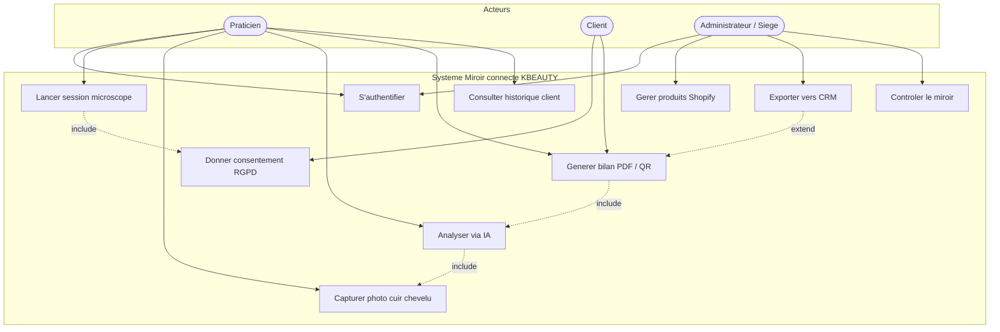
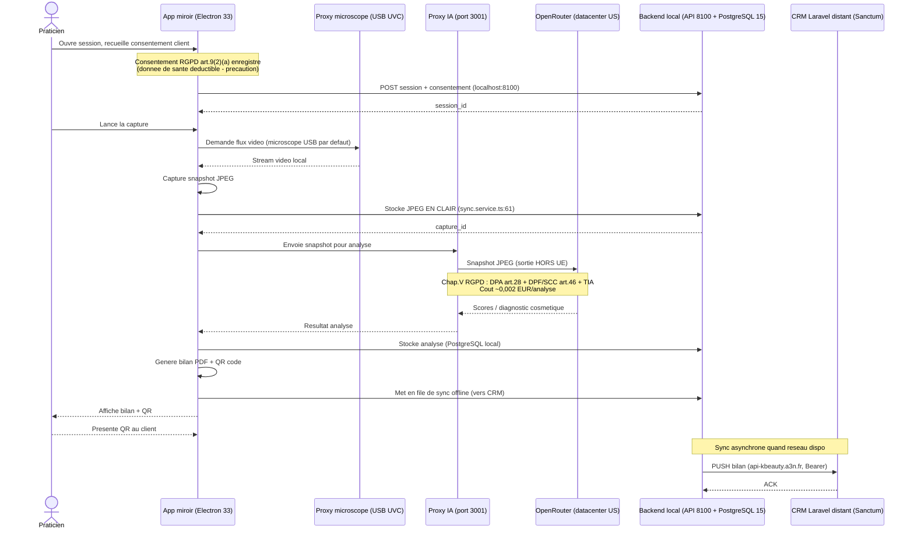
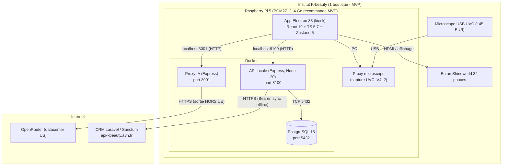

# Livrable 05 - Diagrammes UML

> Projet : Miroir connecté d'analyse capillaire - KBEAUTY / K Beauty Cosmetics
> Chef de projet unique : Adriano [A COMPLETER : nom complet, statut OHADJA]
> Méthodologie : Merise Agile + TDD
> Date : 15 juin 2026

## Préambule - Articulation avec Merise

Ces trois diagrammes UML **complètent** la modélisation Merise existante (MCD / MCT), ils ne la remplacent pas. Le MCD décrit le **quoi** (entités persistées : Client, Session, Capture, Analyse, Bilan, Produit, Boutique) et le MCT le **quand / dans quel ordre** les traitements s'enchaînent côté données. L'UML apporte ici trois vues complémentaires orientées **système** :

- le **cas d'usage** cartographie les acteurs et les fonctions attendues (vue fonctionnelle, en amont des user stories) ;
- le **diagramme de séquence** détaille les échanges inter-composants au runtime (vue dynamique technique, là où le MCT reste conceptuel) ;
- le **diagramme de déploiement** matérialise l'infrastructure physique réelle (vue topologique, absente de Merise).

La cohérence MCD/MCT/UML est maintenue par cross-validation (Mantra #34) : chaque message de séquence qui crée ou lit une donnée correspond à une entité du MCD.

---

## 1. Diagramme de cas d'usage

Le **Praticien** est l'acteur central du parcours en institut : il s'authentifie, lance la session, déclenche la capture microscope et l'analyse IA, puis génère le bilan. Le **Client** n'interagit qu'à deux points : il donne son consentement RGPD (étape bloquante, en relation `include` avec le lancement de session) et récupère son bilan via le QR code. L'**Administrateur / Siège** opère à distance : gestion du catalogue produits Shopify, export CRM et contrôle du parc de miroirs. Les relations `include` traduisent les dépendances obligatoires (pas d'analyse sans capture, pas de bilan sans analyse, pas de session sans consentement). L'export CRM est en `extend` car il est conditionnel (file de synchronisation offline). Périmètre MVP de soutenance : **1 boutique / 1 tenant** ; cible commerciale : **6 miroirs / 3 boutiques** (Nice, Lyon, Cannes).

---

## 2. Diagramme de séquence - Workflow séance (consentement -> QR)

Ce diagramme déroule la séance de bout en bout. Le **consentement** est la première barrière : aucune capture sans accord enregistré (approche par précaution sur l'art.9, la donnée capillaire étant déductible - CJUE C-184/20). Le **microscope est en USB UVC par défaut** (conforme au code ; le WiFi reste une option, le double-WiFi n'est pas implémenté en V1, `wifi.service.ts` ne gère que `wlan0`). Point de vigilance assumé : le snapshot JPEG est **stocké en clair** localement (`sync.service.ts:61`). L'analyse IA est **100 % cloud via OpenRouter** (datacenter US) en V1 : le snapshot **sort de l'UE**, d'où l'obligation Chapitre V (DPA art.28, clauses DPF ou SCC art.46, TIA Schrems II). La **file de sync offline** garantit qu'une coupure réseau ne bloque pas la séance : le bilan est généré localement (PDF + QR), la remontée CRM Laravel (Sanctum, Bearer token) se fait dès que le réseau est disponible. Roadmap non implémentée : analyse CV on-device (OpenCV) ne faisant sortir que des scores anonymisés.

---

## 3. Diagramme de déploiement

Tout le calcul sensible est **local sur le Raspberry Pi 5** (BCM2712). Le Pi héberge l'app Electron en mode kiosk, le proxy microscope et un stack Docker (API locale Express sur **8100**, proxy IA sur **3001**, PostgreSQL 15 sur 5432 ; Adminer sur 8080 en dev). Microscope en **USB**, écran 32 pouces en HDMI. **Seuls deux liens sortent vers Internet** : le proxy IA vers OpenRouter (HTTPS, sortie hors UE - point RGPD majeur) et l'API locale vers le CRM Laravel distant (HTTPS, Bearer, file de sync offline). Aucun Redis dans la stack réelle. RAM : **4 Go recommandés pour le MVP** (footprint mesuré ~1,3-2,2 Go avec Docker on-device) ; décision conditionnée à une mesure terrain 48 h (`free -m` + VmRSS), le 8 Go serait sur-dimensionné. Codec : le Pi 5 décode **HEVC/H.265 4K60 en hardware uniquement** ; H.264, VP9 et AV1 sont décodés en logiciel (CPU), sans aucun encodeur vidéo hardware.

---

## Synthèse TCO indicatif (par miroir)

| Poste | Coût estimé |
|-------|-------------|
| Raspberry Pi 5 (crise RAM juin 2026) | ~150-200 EUR |
| Alimentation 27W | ~12 EUR |
| Refroidisseur actif | ~8 EUR |
| microSD | ~15 EUR |
| Boîtier PETG imprimé (profil SLIM, -28 % épaisseur sans HAT NVMe) | ~5 EUR |
| Microscope USB UVC | ~45 EUR |
| Écran Shineworld 32 pouces | ~700-900 EUR [A COMPLETER : devis ferme] |
| **Coût IA récurrent** | **~0,002 EUR / analyse** |

L'écran est la vraie incertitude du TCO et doit être chiffré par devis. Ces diagrammes serviront de référence à l'implémentation et seront tenus à jour avec le MCD/MCT au fil des sprints.
