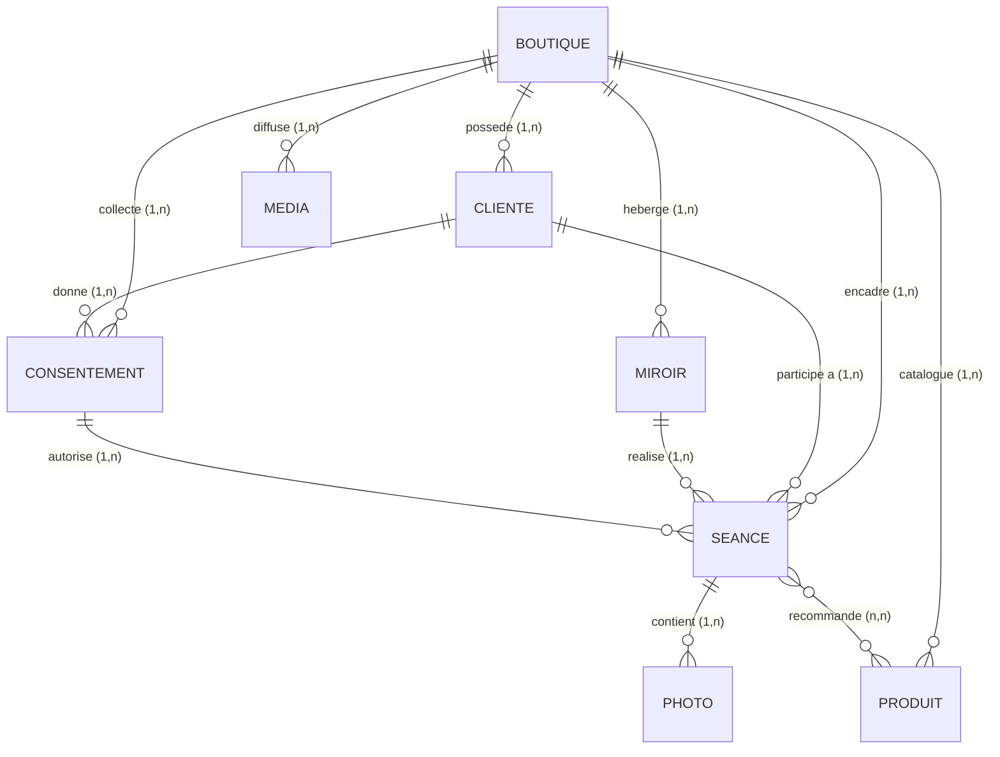
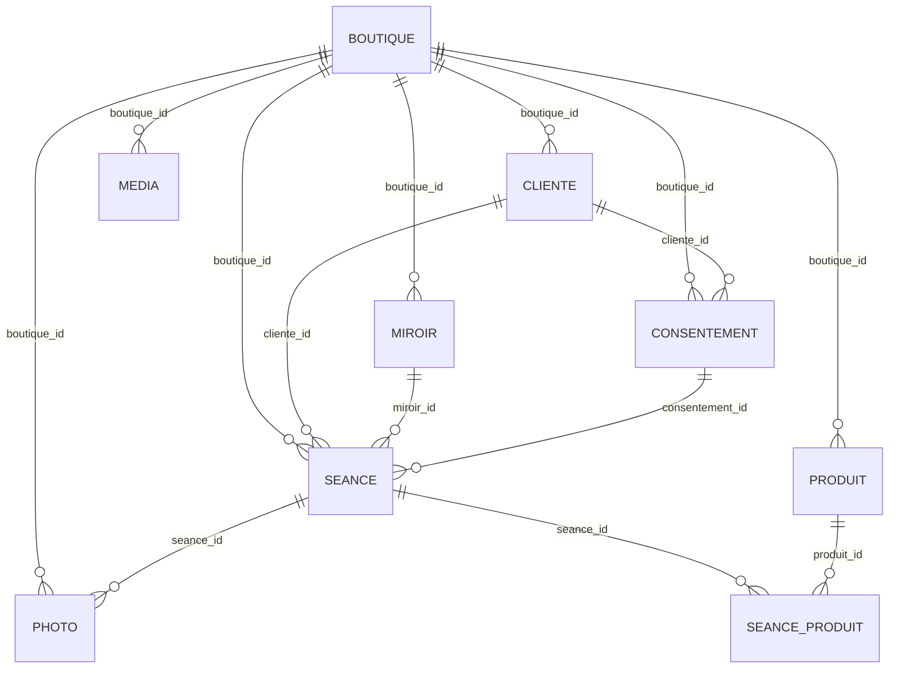

# Livrable 06 - Modèle de données Merise (MCD / MLD)

> Projet : Miroir connecté d'analyse capillaire - KBEAUTY / K Beauty Cosmetics
> Chef de projet unique : Adriano Palamara - alternant chez OHADJA (SAS)
> Méthodologie : Merise Agile + TDD (Mantra #33 « Data Dictionary First », #34 « MCD-MCT Cross-Validation »)
> Source de vérité : migrations Laravel du CRM (`crm/backend/database/migrations/`), schéma final après toutes les migrations.

Ce livrable formalise le **quoi** (données persistées) du système. Il complète les vues UML
(livrable 05 : cas d'usage, séquence, déploiement) qui décrivent le **système** et les traitements.
Les diagrammes sont fournis en source Mermaid (ci-dessous) et en image haute résolution dans
`docs/diagrammes/` (`01-mcd.png`, `02-mld.png`).

---

## 1. Règles de gestion

Les règles de gestion sont la base du MCD ; chaque cardinalité en découle.

| # | Règle |
|---|-------|
| RG1 | Une **boutique** regroupe ses clientes, miroirs, produits, médias, consentements et séances (multi-tenant : cloisonnement par `boutique_id`). |
| RG2 | Une **cliente** appartient à une et une seule boutique ; une boutique a 0 à n clientes. |
| RG3 | Une cliente peut donner plusieurs **consentements** dans le temps (renouvellement, révocation) ; un consentement concerne une seule cliente. |
| RG4 | Une **séance** ne peut démarrer **sans un consentement valide** (non révoqué) : le `consentement_id` est obligatoire (verrou RGPD applicatif + intégrité référentielle). |
| RG5 | Une séance est réalisée par un seul **miroir** et concerne une seule cliente ; un miroir et une cliente peuvent avoir 0 à n séances. |
| RG6 | Une séance contient 1 à n **photos** (au minimum une phase « avant », souvent une « après »). |
| RG7 | Une photo porte un **diagnostic IA** (JSON) et la trace du modèle utilisé + la latence. |
| RG8 | Une séance peut **recommander** plusieurs produits, et un produit peut être recommandé dans plusieurs séances (association n-n via `seance_produits`). |
| RG9 | La **configuration d'affichage** du miroir est un singleton global (une seule ligne, partagée par tout le parc) depuis la migration `make_config_miroir_global_singleton`. |
| RG10 | Un **miroir** est identifié de façon unique par son adresse MAC ; il s'authentifie auprès du CRM par le couple (`adresse_mac`, `token_device`). |
| RG11 | Les **utilisateurs** (personnel : admin / gérant / collaborateur via `role`) gèrent le CRM ; ils ne sont pas rattachés à une séance (acteurs back-office). |

---

## 2. Dictionnaire de données (entités principales)

Type : tels que déclarés dans les migrations PostgreSQL (uuid, text, timestamp, jsonb, boolean...).

### BOUTIQUE
| Attribut | Type | Contrainte | Description |
|----------|------|-----------|-------------|
| id | uuid | PK | Identifiant boutique |
| nom | text | NOT NULL | Raison sociale / enseigne |
| email_contact | text | nullable | Contact boutique |
| shopify_domain | text | nullable | Domaine Shopify lié |
| shopify_access_token | text | nullable | Jeton API Shopify |
| created_at | timestamp | défaut now() | Création |

### CLIENTE
| Attribut | Type | Contrainte | Description |
|----------|------|-----------|-------------|
| id | uuid | PK | Identifiant cliente |
| boutique_id | uuid | FK -> boutiques, NOT NULL | Tenant |
| prenom / nom | text | NOT NULL | Identité |
| email | text | nullable, UNIQUE(email, boutique_id) | Contact (unicité par boutique) |
| telephone | text | nullable | Contact |
| date_de_naissance | date | nullable | Remplace l'ancien champ `age` (migration dédiée) |
| sexe | text | nullable | F / M / autre |
| shopify_customer_id | text | nullable | Liaison e-commerce |

### CONSENTEMENT
| Attribut | Type | Contrainte | Description |
|----------|------|-----------|-------------|
| id | uuid | PK | Identifiant |
| boutique_id | uuid | FK, NOT NULL | Tenant |
| cliente_id | uuid | FK -> clientes, NOT NULL | Cliente concernée |
| texte_consent | text | NOT NULL | Version exacte du texte accepté |
| date_consentement | timestamptz | NOT NULL | Horodatage de l'accord (preuve RGPD) |
| date_revocation | timestamp | nullable | Date de retrait éventuel |

### MIROIR
| Attribut | Type | Contrainte | Description |
|----------|------|-----------|-------------|
| id | uuid | PK | Identifiant miroir |
| boutique_id | uuid | FK, NOT NULL | Tenant |
| nom | text | nullable | Libellé (ex. « Miroir Cabine 1 ») |
| adresse_mac | text | UNIQUE, NOT NULL | Identité matérielle |
| token_device | text | NOT NULL | Secret d'appairage (auth CRM) |
| en_ligne | bool | défaut false | Présence temps réel |
| derniere_activite | timestamp | nullable | Dernier heartbeat |
| version_app | text | nullable | Version applicative |

### SEANCE
| Attribut | Type | Contrainte | Description |
|----------|------|-----------|-------------|
| id | uuid | PK | Identifiant séance |
| boutique_id | uuid | FK, NOT NULL | Tenant |
| miroir_id | uuid | FK -> miroirs (RESTRICT) | Miroir ayant réalisé la séance |
| cliente_id | uuid | FK -> clientes (CASCADE) | Cliente |
| consentement_id | uuid | FK -> consentements (RESTRICT), NOT NULL | Verrou RGPD |
| date_debut | timestamp | NOT NULL | Début |
| date_fin | timestamp | nullable | Fin |
| rapport_pdf_path | text | nullable | Chemin du bilan PDF |
| rapport_url | text | nullable | URL partageable (QR) |
| qr_scanne_at | timestamp | nullable | Trace de remise au client |
| email_envoye | bool | défaut false | Notification envoyée |

### PHOTO
| Attribut | Type | Contrainte | Description |
|----------|------|-----------|-------------|
| id | uuid | PK | Identifiant |
| seance_id | uuid | FK -> seances (CASCADE), NOT NULL | Séance |
| boutique_id | uuid | FK, NOT NULL | Tenant |
| chemin_local | text | NOT NULL | Fichier chiffré sur le device (`.jpg.enc`) |
| chemin_serveur | text | nullable | Emplacement après upload CRM |
| phase | text | NOT NULL | « avant » / « apres » |
| diagnostic_ia | jsonb | nullable | Résultat structuré de l'analyse |
| modele_ia | text | nullable | Modèle utilisé (traçabilité) |
| latence_ms | int | nullable | Temps d'inférence |
| synced | bool | défaut false | Synchronisé vers le CRM |
| supprime_local_at | timestamp | nullable | Purge locale (rétention RGPD) |

### PRODUIT / MEDIA / SEANCE_PRODUIT
| Entité | Attributs clés | Notes |
|--------|----------------|-------|
| PRODUIT | id PK, boutique_id FK, shopify_id, nom, description, fournisseur, prix, mis_en_avant, actif | Catalogue affiché sur le miroir |
| MEDIA | id PK, boutique_id FK, type (video/image), chemin_fichier, url_youtube, checksum, actif | Contenus de veille en boucle |
| SEANCE_PRODUIT | (seance_id, produit_id) PK composite, 2 FK CASCADE | Association n-n séance/produit |

### CONFIG_MIROIR (singleton global)
| Attribut | Type | Description |
|----------|------|-------------|
| id | uuid PK | Ligne unique |
| couleur_primaire / couleur_fond | text | Thème |
| typographie | text | Police |
| fond_anime | bool | Animation de fond |
| volume | int | Volume sonore |

> Note : depuis la migration singleton, `config_miroir` n'a plus de `boutique_id` ni de
> `miroir_id`, et `miroirs` n'a plus de `config_id`. La configuration est globale au parc.

---

## 3. MCD - Modèle Conceptuel de Données

Vue conceptuelle (entités + associations + cardinalités Merise), indépendante de toute
implémentation. Image : `docs/diagrammes/01-mcd.png`.



Lecture : la **BOUTIQUE** est l'entité pivot du multi-tenant. La chaîne métier centrale est
**CLIENTE -> CONSENTEMENT -> SEANCE -> PHOTO** : aucune séance n'existe sans cliente ni sans
consentement (RG4), et chaque séance produit une à plusieurs photos analysées (RG6/RG7).
L'association **SEANCE - PRODUIT** est de type n-n (RG8) : une séance recommande plusieurs
produits, un produit revient dans plusieurs séances.

---

## 4. MLD - Modèle Logique de Données

Traduction relationnelle du MCD. Image : `docs/diagrammes/02-mld.png`.

Règles de passage MCD -> MLD appliquées :
1. Chaque entité devient une table, l'identifiant devient clé primaire (uuid).
2. Toute association **1,n** se traduit par une **clé étrangère** côté « plusieurs »
   (ex. `cliente.boutique_id`, `seance.miroir_id`).
3. L'association **n,n** SEANCE - PRODUIT devient une **table de jonction** `seance_produits`
   à clé primaire composite (`seance_id`, `produit_id`).
4. Les contraintes d'unicité métier deviennent des index UNIQUE (`miroirs.adresse_mac`,
   `clientes(email, boutique_id)`).



Représentation textuelle (clés soulignées par la notation) :

```
BOUTIQUE (id, nom, email_contact, shopify_domain, shopify_access_token, created_at)
USER (id, name, email, password, is_admin, role)
CLIENTE (id, #boutique_id, prenom, nom, email, telephone, date_de_naissance, sexe, shopify_customer_id)
CONSENTEMENT (id, #boutique_id, #cliente_id, texte_consent, date_consentement, date_revocation)
MIROIR (id, #boutique_id, nom, adresse_mac, token_device, en_ligne, derniere_activite, version_app)
CONFIG_MIROIR (id, couleur_primaire, couleur_fond, typographie, fond_anime, volume)   -- singleton
SEANCE (id, #boutique_id, #miroir_id, #cliente_id, #consentement_id, date_debut, date_fin,
        rapport_pdf_path, rapport_url, qr_scanne_at, email_envoye)
PHOTO (id, #seance_id, #boutique_id, chemin_local, chemin_serveur, phase, diagnostic_ia,
       modele_ia, latence_ms, synced, supprime_local_at)
PRODUIT (id, #boutique_id, shopify_id, nom, description, fournisseur, prix, mis_en_avant, actif)
MEDIA (id, #boutique_id, type, chemin_fichier, url_youtube, checksum, actif)
SEANCE_PRODUIT (#seance_id, #produit_id)   -- clé primaire composite
```

---

## 5. Contraintes d'intégrité référentielle

Comportements `ON DELETE` réellement déclarés dans les migrations (choix de conception) :

| Relation | ON DELETE | Justification |
|----------|-----------|---------------|
| cliente -> boutique | CASCADE | Supprimer une boutique purge ses clientes (fermeture de tenant). |
| consentement -> cliente | CASCADE | Le consentement n'a pas de sens sans la cliente. |
| seance -> cliente | CASCADE | Historique rattaché à la cliente. |
| **seance -> consentement** | **RESTRICT** | On **interdit** de supprimer un consentement encore référencé par une séance : preuve RGPD conservée. |
| **seance -> miroir** | **RESTRICT** | On protège l'historique : un miroir avec séances ne peut être supprimé tel quel. |
| photo -> seance | CASCADE | Les photos suivent leur séance. |
| seance_produit -> seance / produit | CASCADE | Nettoyage de l'association. |

Contraintes complémentaires :
- `UNIQUE (miroirs.adresse_mac)` : un seul enregistrement par appareil physique.
- `UNIQUE (clientes.email, boutique_id)` : pas de doublon d'email au sein d'une boutique
  (mais le même email peut exister dans deux boutiques distinctes - cloisonnement tenant).
- Extension `unaccent` + index trigramme (`pg_trgm`) sur `clientes` pour la recherche
  insensible aux accents (migration `add_performance_indexes`).

---

## 6. Cohérence MCD / MLD / code (cross-validation, Mantra #34)

Chaque entité du MCD existe comme table migrée ET comme modèle Eloquent côté CRM
(`crm/backend/app/Models/`), et comme table miroir côté device (`smart-mirror/mock-api/init.sql`).
Le verrou RG4 (pas de séance sans consentement) est vérifié à trois niveaux :
contrainte `NOT NULL` + FK `RESTRICT` (base), validation applicative `POST /api/seances`
(backend, refus 422 sans consentement valide), et test d'intégration automatisé
(`crm/backend/src/server.consent.test.js`). C'est cette traçabilité règle -> schéma -> code -> test
qui matérialise la rigueur Merise Agile + TDD du projet.
