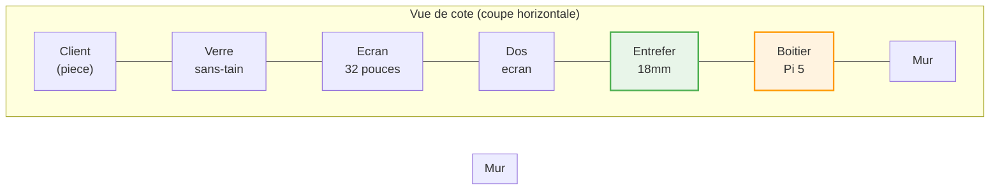
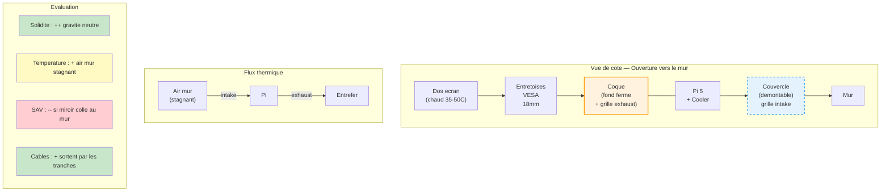
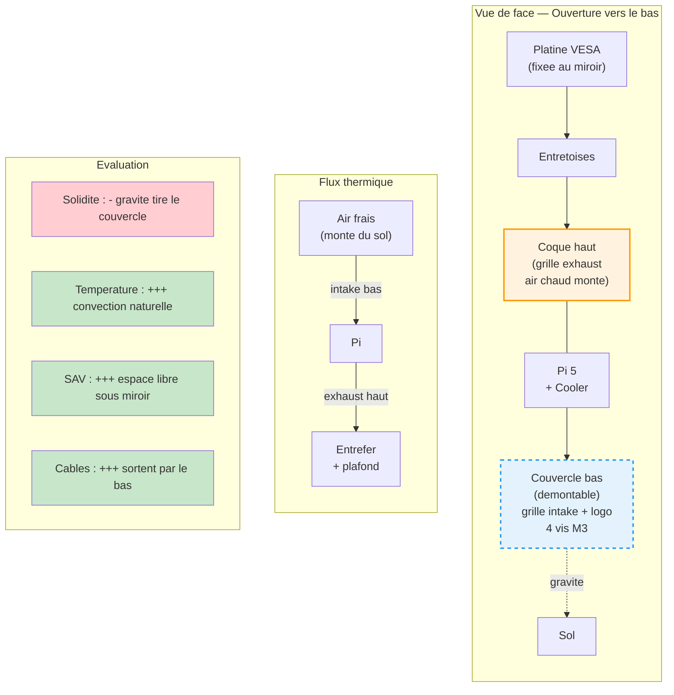
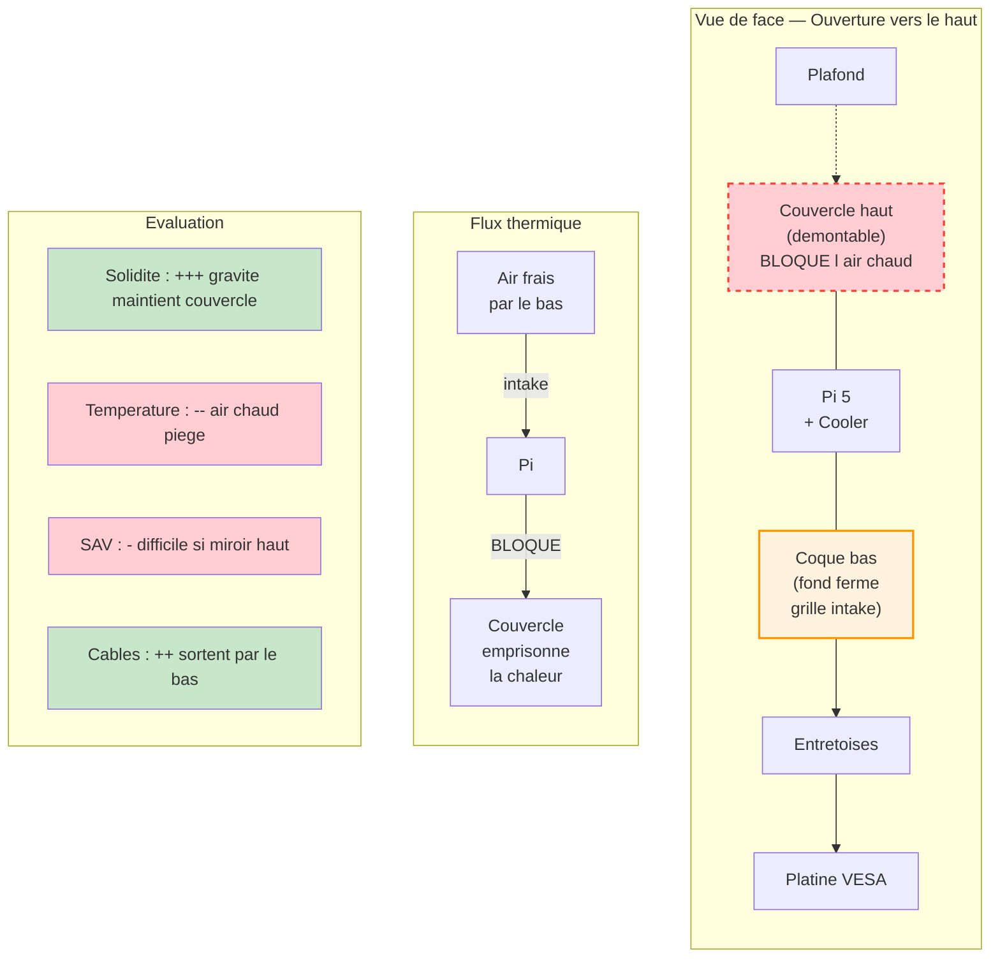
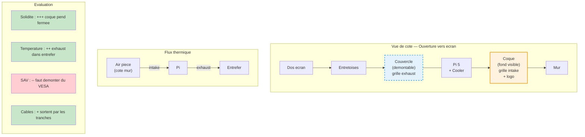

# Orientations boitier Smart Mirror — Diagrammes comparatifs

## Contexte commun

---

## Possibilite 1 — Ouverture vers le mur

---

## Possibilite 2 — Ouverture vers le bas

---

## Possibilite 3 — Ouverture vers le haut

---

## Possibilite 4 — Ouverture vers l ecran

---

## Comparatif final

```mermaid
graph LR
    subgraph SCORE["Score comparatif"]
        direction TB
        H["Critere"]
        H1["1. Vers mur"]
        H2["2. Vers bas"]
        H3["3. Vers haut"]
        H4["4. Vers ecran"]

        SOL["Solidite"]
        SOL1["++"]
        SOL2["-"]
        SOL3["+++"]
        SOL4["+++"]

        TEMP["Temperature"]
        TEMP1["+"]
        TEMP2["+++"]
        TEMP3["--"]
        TEMP4["++"]

        SAV["SAV"]
        SAV_1["--"]
        SAV_2["+++"]
        SAV_3["-"]
        SAV_4["--"]

        CABLE["Cables"]
        CABLE1["+"]
        CABLE2["+++"]
        CABLE3["++"]
        CABLE4["+"]

        TOTAL["TOTAL"]
        TOT1["4/12"]
        TOT2["10/12"]
        TOT3["5/12"]
        TOT4["8/12"]
    end

    style TOT2 fill:#c8e6c9,stroke:#4caf50,stroke-width:3px
    style H2 fill:#c8e6c9,stroke:#4caf50,stroke-width:2px
```

